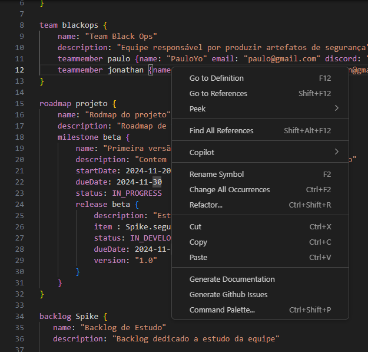

# MADE
It is a plugin that empowers the Scrum Master and the development team to create the backlog and sprints based on processes that can be reused and standardized throughout the project and/or across different projects.

## Install

To install the plugin, there are two methods. For the *first method*, follow these steps: 
1. Download the plugin, 
2. Open Visual Studio Code
3. Right-click and then select "Install Extension VSIX" to initiate the installation.

The *second method* follow these steps:

1. Open the VSCode
2. Click in Extensions
3. Search : MADE-Leds
4. Click in **Install**

## Usage
Right-click on your `.made` file and select "Synchronize With Project Management"  


## Components

### Project:
    Define the project configuration and the token for creating the project in your project manager.

    ```
    project "project-name"{
        id: projectid
        description: "project description"
        email: "email of the project editor"
        host: "host.project.net"
        token: "the api token"
}
```

### Team:
Define a team and inside of it define the members of the team

```
team TeamID {
        name: "team name"
        description: "team description"
        
        teammember memberid {
            name: "member name" 
            email:"member@email.com"
            }
}
```

### Timebox:
Define the timebox its responsibles, planning and performed

```
timebox timeboxid {
        name: "timebox name"
        description: "timebox description"
        startDate: "2024-01-01"
        endDate: "2024-12-12"

        responsible: TeamID.memberid 

        planning {
                item: "planning item" assignee: "member name"
        } 

        performed{
                item: "performed item" status: DOING
        }
}
```

### Process: 
Define the project and its activities.
```
process processID {
        name: "process name"
        description: "process description"

        activity activityID{
                name: "activity name"
                description: "activity description"
        }
}
```

### BackLog:
Define the backlog its epics and user stories.

```
backlog BackLogID  {
        name: "backlog name"
        description: "backlog description"
        epic EpicId {
                name: "Epic name"
                process: processID
        }
        userstory userstoryId {
                name: "User story name"
                activity: processID.activityID
        }
}
```

<!-- ### RoadMap:
Define the road map, its versions and the versions planning

```
roadmap RoadMapID {
        name: "Road map name"
        description: "Road map description"

        version RoadMapVersionID {
                name: "Road map version name"
                description: "Road map version description"
                startDate: "2024-01-01"
                endDate: "2024-12-12"

                planning {
                        item: BackLogID.userstoryId
                        item: "planning item"
                }
        }
}
``` -->