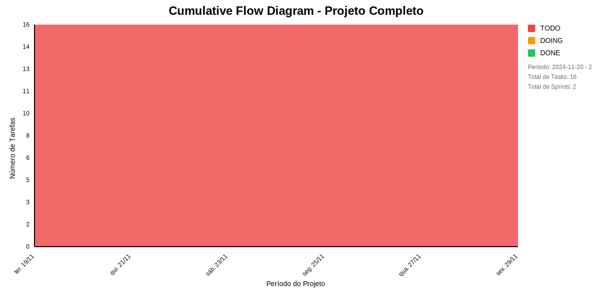

# 📊 Visão Geral do Projeto 

 Time de QA (Quality Assurance) do projeto ConectaFapes.
* Data de Início: 01/12/2024
* Data de Planejado: 31/12/2025
* Data de Finalização: 

 Time de QA (Quality Assurance) do projeto ConectaFapes.
## Métricas Consolidadas

| Sprint | Período | Duração | Total Tasks | Concluídas | Em Progresso | Pendentes | Velocidade | Eficiência |
|--------|---------|----------|-------------|------------|--------------|-----------|------------|------------|
| Estudar Autorizacao | 19/11 - 29/11 | 10 dias | 8 | 0 (0.0%) | 0 | 8 | 0/dia | 0.0% |
| Apresentar os estudos Autorizacao | 19/11 - 29/11 | 10 dias | 8 | 0 (0.0%) | 0 | 8 | 0/dia | 0.0% |

## Análise Geral

- **Total de Sprints:** 2
- **Total de Tasks:** 16
- **Taxa de Conclusão:** 0.0%

### Notas
- Período Total: 19/11 - 29/11
- Média de Duração das Sprints: 10 dias

*Última atualização: julho de 2025*

## Cumulative Flow 

 ## Previsão do Projeto 

## 🎯 Conclusão Principal

### ✅ PROJETO PROVAVELMENTE SERÁ CONCLUÍDO NO PRAZO

- **Probabilidade de conclusão no prazo**: 100.0%
- **Data mais provável de conclusão**: ter., 22/07/2025
- **Dias em relação ao planejado**: 235 dias
- **Status**: ❌ Atraso Crítico

### 📊 Métricas do Projeto

| Métrica | Valor | Status |
|---------|--------|--------|
| Velocidade Atual | 1.0 tarefas/dia | ❌ |
| Velocidade Necessária | 16.0 tarefas/dia | - |
| Dias Restantes | 1 dias | - |
| Tarefas Restantes | 16 tarefas | - |

### 📅 Previsões de Data de Conclusão

| Data | Probabilidade | Status | Observação |
|------|---------------|---------|------------|
| ter., 22/07/2025 | 100.0% | ❌ Atraso Crítico | 📍 Data mais provável |

## 💡 Recomendações

1. ✅ Manter o ritmo atual de 1.0 tarefas/dia
2. ✅ Continuar monitorando impedimentos
3. ✅ Planejar próximas sprints com antecedência

## ℹ️ Informações do Projeto

- **Total de Sprints**: 2
- **Início**: ter., 19/11/2024
- **Término Planejado**: sex., 29/11/2024
- **Total de Tarefas**: 16
- **Simulações Realizadas**: 10,000

---
*Relatório gerado em 01/07/2025, 00:10:27*