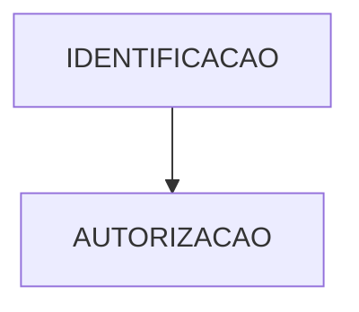
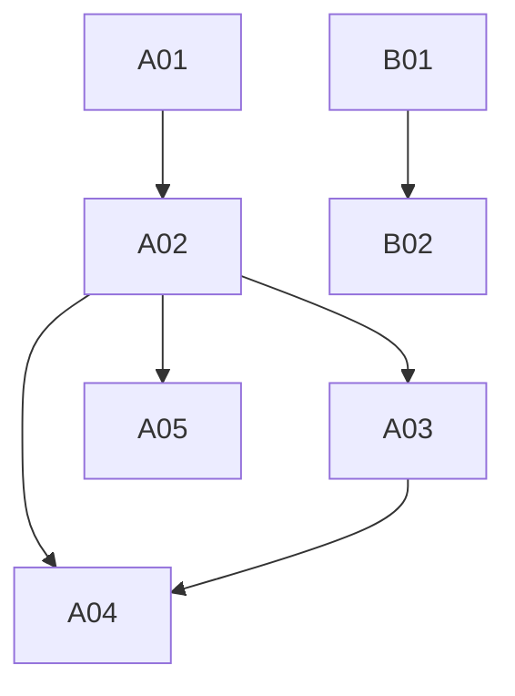

## Matrix de Dependencia dos Casos de uso
| Item | Descrição | Dependências | Habilitados | Atores |
| --- | --- | --- | --- | --- |
| IDENTIFICACAO | Identificação de Agente |  | AUTORIZACAO |  |
| AUDITORIA | Auditoria de Eventos |  |  |  |
| AUTORIZACAO | Gestão da autorização | IDENTIFICACAO |  |  |

### Ciclos
Caso exista ciclo, será apresentado abaixo:

### Grafo de Dependencia

## Matrix de Dependencia dos Eventos
| Item | Descrição | Dependências | Habilitados | Atores |
| --- | --- | --- | --- | --- |
| A01 | Criar Repositorio de Politicas |  | A02 |  |
| A02 | Criar Politicas | A01 | A03, A04, A05 |  |
| B01 | Registrar Evento |  | B02 |  |
| A03 | Aplicar Politicas | A02 | A04 |  |
| I01 | Identificar o agente por meio do acesso cidadão |  |  |  |
| B02 | Consultar Evento  | B01 |  |  |
| A05 | Autorização por 2FA | A02 |  |  |
| A04 | Recuperar recurso | A02, A03 |  |  |

### Ciclos
Caso exista ciclo, será apresentado abaixo:

### Grafo de Dependencia

