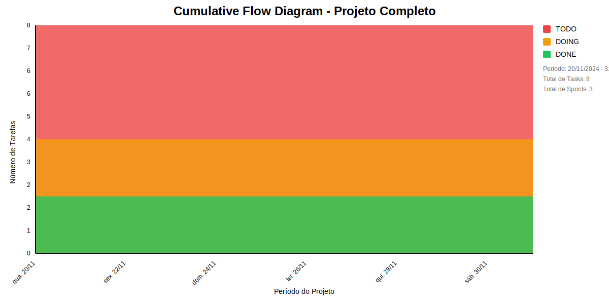

# 📊 Visão Geral do Projeto 

## Métricas Consolidadas

| Sprint | Período | Duração | Total Tasks | Concluídas | Em Progresso | Pendentes | Velocidade | Eficiência |
|--------|---------|----------|-------------|------------|--------------|-----------|------------|------------|
| Estudar Autorizacao | 19/11 - 29/11 | 10 dias | 2 | 0 (0.0%) | 0 | 2 | 0/dia | 0.0% |
| Apresentar os estudos Autorizacao | 19/11 - 29/11 | 10 dias | 2 | 0 (0.0%) | 0 | 2 | 0/dia | 0.0% |
| Apresentar Autorizacao | 29/11 - 30/11 | 1 dias | 3 | 1 (33.3%) | 1 | 1 | 1/dia | 33.3% |

## Análise Geral

- **Total de Sprints:** 3
- **Total de Tasks:** 7
- **Taxa de Conclusão:** 14.3%

### Notas
- Período Total: 19/11 - 30/11
- Média de Duração das Sprints: 7 dias

*Última atualização: novembro de 2024*

## Cumulative Flow 

 ## Previsão do Projeto 

## 🎯 Conclusão Principal

### ✅ PROJETO PROVAVELMENTE SERÁ CONCLUÍDO NO PRAZO

- **Probabilidade de conclusão no prazo**: 100.0%
- **Data mais provável de conclusão**: seg., 02/12/2024
- **Dias em relação ao planejado**: 2 dias
- **Status**: ⚠️ Pequeno Atraso

### 📊 Métricas do Projeto

| Métrica | Valor | Status |
|---------|--------|--------|
| Velocidade Atual | 1.0 tarefas/dia | ✅ |
| Velocidade Necessária | 1.0 tarefas/dia | - |
| Dias Restantes | 6 dias | - |
| Tarefas Restantes | 6 tarefas | - |

### 📅 Previsões de Data de Conclusão

| Data | Probabilidade | Status | Observação |
|------|---------------|---------|------------|
| seg., 02/12/2024 | 100.0% | ⚠️ Pequeno Atraso | 📍 Data mais provável |

## 💡 Recomendações

1. ✅ Manter o ritmo atual de 1.0 tarefas/dia
2. ✅ Continuar monitorando impedimentos
3. ✅ Planejar próximas sprints com antecedência

## ℹ️ Informações do Projeto

- **Total de Sprints**: 3
- **Início**: qua., 20/11/2024
- **Término Planejado**: dom., 01/12/2024
- **Total de Tarefas**: 7
- **Simulações Realizadas**: 10,000

---
*Relatório gerado em 25/11/2024, 13:01:28*