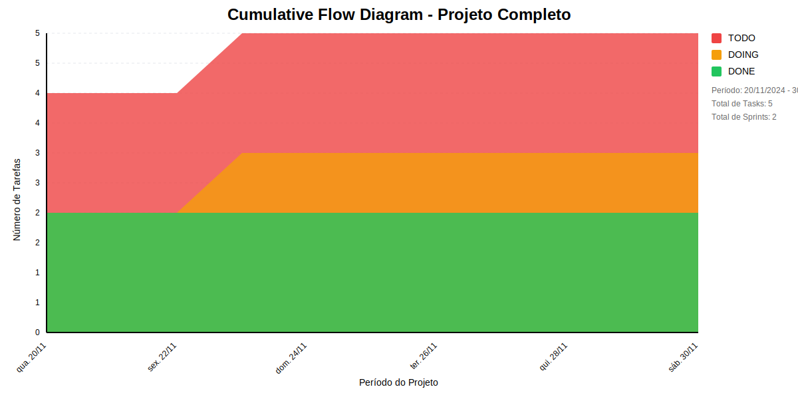
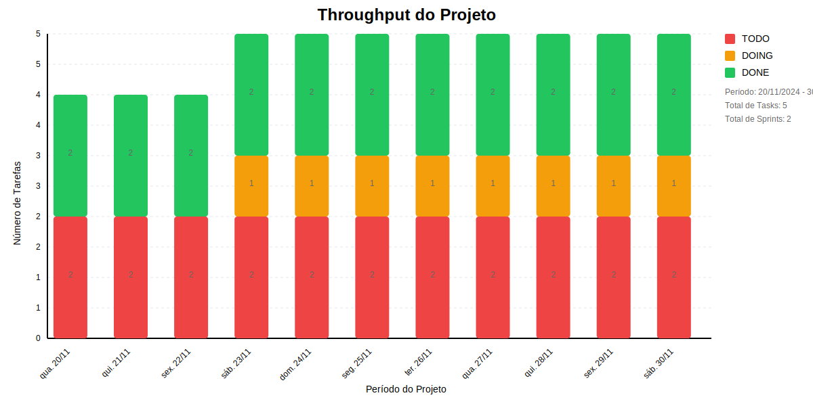

# Resumo do Projeto 

## Métricas Consolidadas

| Sprint | Período | Duração | Total Tasks | Concluídas | Em Progresso | Pendentes | Velocidade | Eficiência |
|--------|---------|----------|-------------|------------|--------------|-----------|------------|------------|
| Sprint 1 - Alvo e Esboço | 02/01 - 05/01 | 3 dias | 3 | 3 (100.0%) | 0 | 0 | 1/dia | 100.0% |
| Sprint 2 - Prototipação | 08/01 - 12/01 | 4 dias | 5 | 5 (100.0%) | 0 | 0 | 1.25/dia | 100.0% |
| Sprint 3 - Low Code | 22/01 - 26/01 | 5 dias | 14 | 14 (100.0%) | 0 | 0 | 2.8/dia | 100.0% |
| Spike de DotNet | 29/01 - 02/02 | 4 dias | 5 | 5 (100.0%) | 0 | 0 | 1.25/dia | 100.0% |
| Analise | 05/02 - 09/02 | 5 dias | 1 | 1 (100.0%) | 0 | 0 | 0.2/dia | 100.0% |
| Categoria e Funcao | 26/02 - 08/03 | 12 dias | 14 | 12 (85.7%) | 2 | 0 | 1/dia | 85.7% |
| Projeto | 12/03 - 15/03 | 4 dias | 25 | 25 (100.0%) | 0 | 0 | 6.25/dia | 100.0% |
| Spike 2 | 18/03 - 22/03 | 5 dias | 4 | 3 (75.0%) | 1 | 0 | 0.6/dia | 75.0% |
| NovaSprint | 19/03 - 22/03 | 3 dias | 5 | 5 (100.0%) | 0 | 0 | 1.67/dia | 100.0% |
| Refatoração & Integração 2 | 25/03 - 29/03 | 5 dias | 8 | 4 (50.0%) | 4 | 0 | 0.8/dia | 50.0% |
| Refatoração 3 | 01/04 - 12/04 | 12 dias | 13 | 6 (46.2%) | 7 | 0 | 0.5/dia | 46.2% |
| Gordura | 15/04 - 19/04 | 5 dias | 12 | 5 (41.7%) | 7 | 0 | 1/dia | 41.7% |
| Sprint 12 | 22/04 - 03/05 | 11 dias | 21 | 11 (52.4%) | 10 | 0 | 1/dia | 52.4% |

## Análise Geral

- **Total de Sprints:** 13
- **Total de Tasks:** 130
- **Taxa de Conclusão:** 76.2%

### Notas
- Período Total: 02/01 - 03/05
- Média de Duração das Sprints: 6 dias

*Última atualização: novembro de 2024*## Cumulative Flow 

## Throughput 

 ## Relatório de Previsão do Projeto - Método Monte Carlo

## 🎯 Conclusão Principal

### ❌ ALTO RISCO DE ATRASO NO PROJETO

- **Probabilidade de conclusão no prazo**: 0.2%
- **Data mais provável de conclusão**: ter., 03/12/2024
- **Dias em relação ao planejado**: 215 dias
- **Status**: ❌ Atraso Crítico

### 📊 Métricas do Projeto

| Métrica | Valor | Status |
|---------|--------|--------|
| Velocidade Atual | 2.9 tarefas/dia | ❌ |
| Velocidade Necessária | Infinity tarefas/dia | - |
| Dias Restantes | 0 dias | - |
| Tarefas Restantes | 31 tarefas | - |

### 📅 Previsões de Data de Conclusão

| Data | Probabilidade | Status | Observação |
|------|---------------|---------|------------|
| qui., 21/11/2024 | 0.2% | ❌ Atraso Crítico |  |
| sex., 22/11/2024 | 1.1% | ❌ Atraso Crítico |  |
| seg., 25/11/2024 | 2.6% | ❌ Atraso Crítico |  |
| ter., 26/11/2024 | 4.1% | ❌ Atraso Crítico |  |
| qua., 27/11/2024 | 5.2% | ❌ Atraso Crítico |  |
| qui., 28/11/2024 | 7.1% | ❌ Atraso Crítico |  |
| sex., 29/11/2024 | 9.1% | ❌ Atraso Crítico |  |
| seg., 02/12/2024 | 10.7% | ❌ Atraso Crítico |  |
| ter., 03/12/2024 | 11.7% | ❌ Atraso Crítico | 📍 Data mais provável |
| qua., 04/12/2024 | 10.3% | ❌ Atraso Crítico |  |
| qui., 05/12/2024 | 9.3% | ❌ Atraso Crítico |  |
| sex., 06/12/2024 | 7.4% | ❌ Atraso Crítico |  |
| seg., 09/12/2024 | 6.4% | ❌ Atraso Crítico |  |
| ter., 10/12/2024 | 5.2% | ❌ Atraso Crítico |  |
| qua., 11/12/2024 | 4.0% | ❌ Atraso Crítico |  |
| qui., 12/12/2024 | 2.6% | ❌ Atraso Crítico |  |
| sex., 13/12/2024 | 1.6% | ❌ Atraso Crítico |  |
| seg., 16/12/2024 | 0.8% | ❌ Atraso Crítico |  |
| ter., 17/12/2024 | 0.4% | ❌ Atraso Crítico |  |
| qua., 18/12/2024 | 0.2% | ❌ Atraso Crítico |  |
| qui., 19/12/2024 | 0.1% | ❌ Atraso Crítico |  |
| sex., 20/12/2024 | 0.0% | ❌ Atraso Crítico |  |
| seg., 23/12/2024 | 0.0% | ❌ Atraso Crítico |  |

## 💡 Recomendações

1. ❌ Realizar reunião de emergência
2. ❌ Reavaliar escopo do projeto
3. ❌ Considerar adição de recursos ou redução de escopo

## ℹ️ Informações do Projeto

- **Total de Sprints**: 13
- **Início**: ter., 02/01/2024
- **Término Planejado**: sex., 03/05/2024
- **Total de Tarefas**: 130
- **Simulações Realizadas**: 10,000

---
*Relatório gerado em 19/11/2024, 10:00:47*