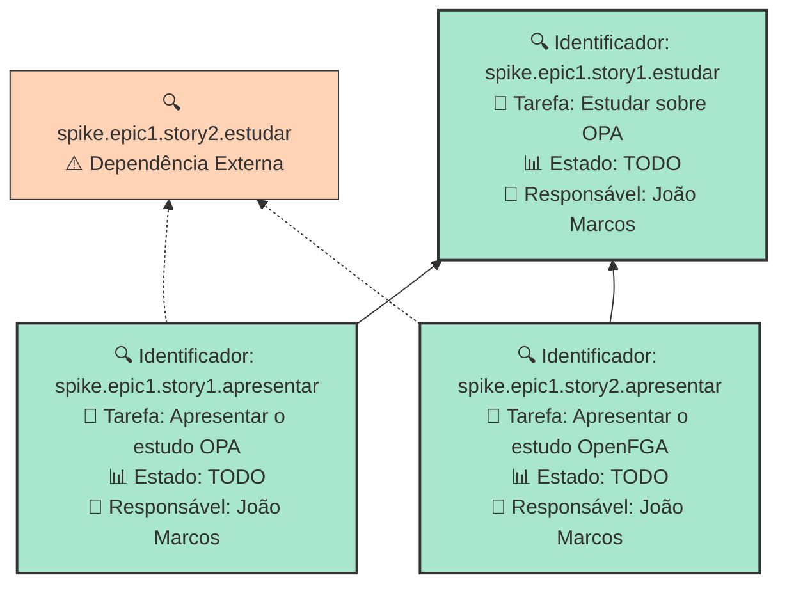

## Dados do Sprint
* **Goal**:  Realizar estudos sobre autorizacao
* **Data Início**: 20/11/2024
* **Data Fim**: 30/11/2024

## Sprint Backlog

|ID |Nome |Resposável |Data de Inicío | Data Planejada | Status|
|:----    |:----|:--------  |:-------:       | :----------:  | :---: |
|spike.epic1.story1.estudar|Estudar sobre OPA|João Marcos |20/11/2024|30/11/2024|TODO|
|spike.epic1.story1.apresentar|Apresentar o estudo OPA|João Marcos |20/11/2024|30/11/2024|TODO|
|spike.epic1.story2.apresentar|Apresentar o estudo OpenFGA|João Marcos |20/11/2024|30/11/2024|TODO|

# Análise de Dependências do Sprint

Análise gerada em: 24/11/2024, 21:05:52

## 🔍 Grafo de Dependências

**Legenda:**
- 🟢 Verde Claro: Issues no sprint
- 🟢 Verde Escuro: Issues concluídas
- 🟡 Laranja: Dependências externas ao sprint
- ➡️ Linha sólida: Dependência no sprint
- ➡️ Linha pontilhada: Dependência externa

## 📋 Sugestão de Execução das Issues

| # | Issue | Título | Status | Responsável | Dependências |
|---|-------|--------|--------|-------------|---------------|
| 1 | spike.epic1.story1.estudar | Estudar sobre OPA | TODO | João Marcos  | 🆓 |
| 2 | spike.epic1.story1.apresentar | Apresentar o estudo OPA | TODO | João Marcos  | spike.epic1.story2.estudar⚠️, spike.epic1.story1.estudar |
| 3 | spike.epic1.story2.apresentar | Apresentar o estudo OpenFGA | TODO | João Marcos  | spike.epic1.story2.estudar⚠️, spike.epic1.story1.estudar |

**Legenda das Dependências:**
- 🆓 Sem dependências
- ✅ Issue concluída
- ⚠️ Dependência externa ao sprint

## Gráficos
### Throughput

### Cumulative Flow

# Relatório de Previsão da Sprint baseado no Método de Monte Carlo

## 🎯 Conclusão Principal

### ✅ SPRINT PROVAVELMENTE SERÁ CONCLUÍDA NO PRAZO

- **Probabilidade de conclusão no prazo**: 100.0%
- **Data mais provável de conclusão**: qui., 28/11/2024
- **Dias em relação ao planejado**: -1 dias
- **Status**: ✅ Antes do Prazo

### 📊 Métricas Críticas

| Métrica | Valor | Status |
|---------|--------|--------|
| Velocidade Atual | 1.0 tarefas/dia | ✅ |
| Velocidade Necessária | 0.5 tarefas/dia | - |
| Dias Restantes | 6 dias | - |
| Tarefas Restantes | 3 tarefas | - |

### 📅 Previsões de Data de Conclusão

| Data | Probabilidade | Status | Observação |
|------|---------------|---------|------------|
| qui., 28/11/2024 | 100.0% | ✅ Antes do Prazo | 📍 Data mais provável |

### 📋 Status das Tarefas

| Status | Quantidade | Porcentagem |
|--------|------------|-------------|
| Concluído | 0 | 0.0% |
| Em Andamento | 0 | 0.0% |
| A Fazer | 3 | 100.0% |

## 💡 Recomendações

1. ✅ Mantenha o ritmo atual de 1.0 tarefas/dia
2. ✅ Continue monitorando impedimentos
3. ✅ Prepare-se para a próxima sprint

## ℹ️ Informações da Sprint

- **Sprint**: Estudar Autorizacao
- **Início**: qua., 20/11/2024
- **Término Planejado**: sáb., 30/11/2024
- **Total de Tarefas**: 3
- **Simulações Realizadas**: 10,000

---
*Relatório gerado em 24/11/2024, 21:05:52*
