## Dados do Sprint
* **Goal**:  estudoooo
* **Data Início**: 20/11/2024
* **Data Fim**: 30/11/2024

## Sprint Backlog

|ID |Nome |Resposável |Data de Inicío | Data Planejada | Status|
|:----    |:----|:--------  |:-------:       | :----------:  | :---: |
|AUTENTICACAO|CRIAR MÓDULO DE AUTORIZAÇÃO|RAFAEL EMERICK|20/11/2024|30/11/2024|TODO|
|ESTUDO|ESTUDAR A ARQUITETURA DE AUTORIZAÇÃO PROPOSTA PELO NIS|RAFAEL EMERICK|23/11/2024|30/11/2024|DOING|
|ESTUDO|ESTUDAR A ARQUITETURA DE AUTORIZAÇÃO PROPOSTA PELO NIS|RAFAEL EMERICK|20/11/2024|30/11/2024|DONE|

# Análise de Dependências do Projeto e Sprint

Análise gerada em: 22/11/2024, 20:07:08

## 📊 Resumo por Status

| Status | Quantidade |
|--------|------------|
| TODO | 4 |
| DONE | 1 |

## 🔍 Grafo de Dependências

```mermaid
graph TD
    classDef sprint fill:#a8e6cf,stroke:#333,stroke-width:2px;
    classDef external fill:#ffd3b6,stroke:#333,stroke-width:2px;
    classDef pending fill:#ff8b94,stroke:#333,stroke-width:2px;
    classDef done fill:#98fb98,stroke:#333,stroke-width:2px;
    autenticacao["autenticacao\nCriar Módulo de autorização\nTODO\nResp: Rafael Emerick"]:::sprint
    estudo["estudo\nEstudar a arquitetura de autorização proposta pelo NIS\nDONE\nResp: Rafael Emerick"]:::done
```

**Legenda:**
- 🟢 Verde Escuro: Issues concluídas (DONE)
- 🟢 Verde Claro: Issues no sprint atual
- 🟡 Laranja: Issues no projeto, fora do sprint
- 🔴 Vermelho: Issues pendentes
- ➡️ Linha dupla: Dependência implementada
- ➡️ Linha sólida: Dependência no sprint
- ➡️ Linha pontilhada: Dependência externa

## 📋 Análise de Issues

| Issue | Título | Status | Localização | Responsável | # Deps | # Bloqueada por | Dependências | Dependentes |
|-------|--------|--------|-------------|-------------|--------|-----------------|--------------|-------------|
| autenticacao | Criar Módulo de autorização | TODO | 🟢 Sprint | Rafael Emerick | 0 | 0 | - | - |
| estudo | Estudar a arquitetura de autorização proposta pelo NIS | DONE | ✅ Concluída | Rafael Emerick | 0 | 0 | - | - |

## Gráficos
### Throughput

### Cumulative Flow

# Relatório de Previsão da Sprint baseado no Método de Monte Carlo

## 🎯 Conclusão Principal

### ✅ SPRINT PROVAVELMENTE SERÁ CONCLUÍDA NO PRAZO

- **Probabilidade de conclusão no prazo**: 100.0%
- **Data mais provável de conclusão**: seg., 25/11/2024
- **Dias em relação ao planejado**: -4 dias
- **Status**: ✅ Antes do Prazo

### 📊 Métricas Críticas

| Métrica | Valor | Status |
|---------|--------|--------|
| Velocidade Atual | 1.0 tarefas/dia | ✅ |
| Velocidade Necessária | 0.3 tarefas/dia | - |
| Dias Restantes | 8 dias | - |
| Tarefas Restantes | 2 tarefas | - |

### 📅 Previsões de Data de Conclusão

| Data | Probabilidade | Status | Observação |
|------|---------------|---------|------------|
| seg., 25/11/2024 | 100.0% | ✅ Antes do Prazo | 📍 Data mais provável |

### 📋 Status das Tarefas

| Status | Quantidade | Porcentagem |
|--------|------------|-------------|
| Concluído | 1 | 33.3% |
| Em Andamento | 1 | 33.3% |
| A Fazer | 1 | 33.3% |

## 💡 Recomendações

1. ✅ Mantenha o ritmo atual de 1.0 tarefas/dia
2. ✅ Continue monitorando impedimentos
3. ✅ Prepare-se para a próxima sprint

## ℹ️ Informações da Sprint

- **Sprint**: estudo
- **Início**: qua., 20/11/2024
- **Término Planejado**: sáb., 30/11/2024
- **Total de Tarefas**: 3
- **Simulações Realizadas**: 10,000

---
*Relatório gerado em 22/11/2024, 20:07:08*
