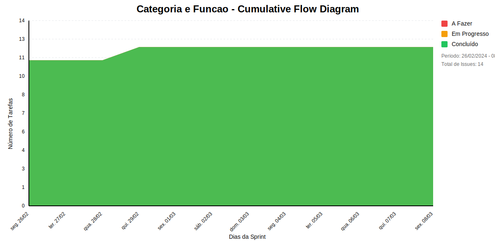

## Dados do Sprint
* **Goal**: -
* **Data Início**: 26/02/2024
* **Data Fim**: 08/03/2024
* **Status**: CLOSED

## Sprint Backlog

|ID |Nome |Resposável |Data de Inicío | Data Planejada | Status|
|:----    |:----|:--------  |:-------:       | :----------:  | :---: |
|SLAVE-259|EU, NO PAPEL DE COORDENADOR, QUERO CADASTRAR UM PROJETO|BRUNO CAXIAS|07/03/2024|14/03/2024|EM ANDAMENTO|
|SLAVE-258|EU, NO PAPEL DE COORDENADOR, QUERO CADASTRAR A PESSOA DE UM PROJETO|VINÍCIUS ESTEVAM|07/03/2024|14/03/2024|EM ANDAMENTO|
|SLAVE-165|EU, NO PAPEL DE COORDENADOR, QUERO CADASTRAR A CATEGORIA DE UM PROJETO|undefined|24/02/2024|-|CONCLUÍDO|
|SLAVE-164|EU, NO PAPEL DE COORDENADOR, QUERO CADASTRAR AS FUNÇÕES DE UMA ORGANIZAÇÃO|undefined|24/02/2024|-|CONCLUÍDO|
|SLAVE-167|CRIAR DE UMA ENTIDADE|BRUNO CAXIAS|24/02/2024|-|CONCLUÍDO|
|SLAVE-170|EDITAR DE UMA ENTIDADE|BRUNO CAXIAS|24/02/2024|-|CONCLUÍDO|
|SLAVE-169|LISTAR DE UMA ENTIDADE|BRUNO CAXIAS|24/02/2024|-|CONCLUÍDO|
|SLAVE-168|CRIAR DE UMA ENTIDADE|BRUNO CAXIAS|24/02/2024|-|CONCLUÍDO|
|SLAVE-171|LISTAR DE UMA ENTIDADE|BRUNO CAXIAS|24/02/2024|-|CONCLUÍDO|
|SLAVE-173|CRIAR AS PASTAS QUE REPRESENTE AS CAMADAS MODEL-VIEW-CONTROLE|BRUNO CAXIAS|24/02/2024|-|CONCLUÍDO|
|SLAVE-172|CRIAR INFRAESTRURA BASE DO PROJETO|VINÍCIUS ESTEVAM|24/02/2024|-|CONCLUÍDO|
|SLAVE-174|CRIAR O MODELO DE DOMINIO BASEADO NO DIAGRAMA DE CLASSES|VINÍCIUS ESTEVAM|24/02/2024|-|CONCLUÍDO|
|SLAVE-176|EDITAR DE UMA ENTIDADE|BRUNO CAXIAS|24/02/2024|-|CONCLUÍDO|
|SLAVE-226|EU, COMO DESENVOLVEDOR, QUERO FAZER A GESTÃO DE CONHECIMENTO SOBRE AUTOMAÇÃO NO JIRA COM GITLAB|SOFIA DE ALCANTARA|28/02/2024|-|CONCLUÍDO|

# Relatório de Previsão da Sprint baseado no Método de Monte Carlo

## 🎯 Conclusão Principal

### ✅ SPRINT PROVAVELMENTE SERÁ CONCLUÍDA NO PRAZO

- **Probabilidade de conclusão no prazo**: 100.0%
- **Data mais provável de conclusão**: ter., 19/11/2024
- **Dias em relação ao planejado**: 256 dias
- **Status**: ❌ Atraso Crítico

### 📊 Métricas Críticas

| Métrica | Valor | Status |
|---------|--------|--------|
| Velocidade Atual | 4.0 tarefas/dia | ❌ |
| Velocidade Necessária | Infinity tarefas/dia | - |
| Dias Restantes | 0 dias | - |
| Tarefas Restantes | 2 tarefas | - |

### 📅 Previsões de Data de Conclusão

| Data | Probabilidade | Status | Observação |
|------|---------------|---------|------------|
| ter., 19/11/2024 | 100.0% | ❌ Atraso Crítico | 📍 Data mais provável |

### 📋 Status das Tarefas

| Status | Quantidade | Porcentagem |
|--------|------------|-------------|
| Concluído | 12 | 85.7% |
| Em Andamento | 0 | 0.0% |
| A Fazer | 0 | 0.0% |

## 💡 Recomendações

1. ✅ Mantenha o ritmo atual de 4.0 tarefas/dia
2. ✅ Continue monitorando impedimentos
3. ✅ Prepare-se para a próxima sprint

## ℹ️ Informações da Sprint

- **Sprint**: Categoria e Funcao
- **Início**: seg., 26/02/2024
- **Término Planejado**: sex., 08/03/2024
- **Total de Tarefas**: 14
- **Simulações Realizadas**: 10,000

---
*Relatório gerado em 19/11/2024, 10:50:27*

# Gráficos
## Throughput

## Cumulative Flow

