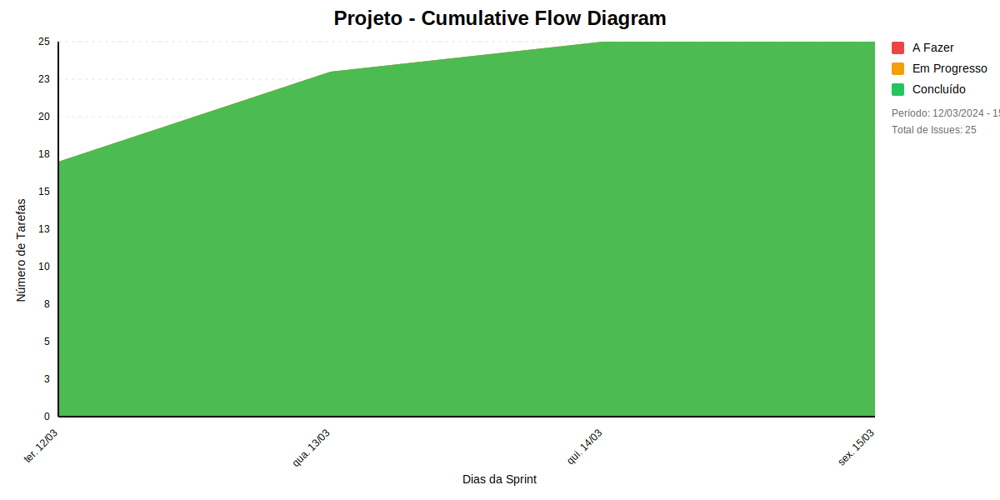

## Dados do Sprint
* **Goal**: -
* **Data Início**: 12/03/2024
* **Data Fim**: 15/03/2024
* **Status**: CLOSED

## Sprint Backlog

|ID |Nome |Resposável |Data de Inicío | Data Planejada | Status|
|:----    |:----|:--------  |:-------:       | :----------:  | :---: |
|SLAVE-263|EU, COMO DESENVOLVEDOR, QUERO REFLETIR MIGRATION NO BANCO DE DADOS|VINÍCIUS ESTEVAM|11/03/2024|-|CONCLUÍDO|
|SLAVE-281|EU, NO PAPEL DE COORDENADOR, QUERO EDITAR  OS PROJETOS DE UMA ORGANIZAÇÃO|VINÍCIUS ESTEVAM|11/03/2024|-|CONCLUÍDO|
|SLAVE-286|EU, NO PAPEL DE COORDENADOR, QUERO LISTAR  OS PROJETOS DE UMA ORGANIZAÇÃO|VINÍCIUS ESTEVAM|11/03/2024|-|CONCLUÍDO|
|SLAVE-280|EU, NO PAPEL DE COORDENADOR, QUERO EXCLUIR  OS PROJETOS DE UMA ORGANIZAÇÃO|VINÍCIUS ESTEVAM|11/03/2024|-|CONCLUÍDO|
|SLAVE-285|EU, NO PAPEL DE COORDENADOR, QUERO CRIAR OS PROJETOS DE UMA ORGANIZAÇÃO|VINÍCIUS ESTEVAM|11/03/2024|-|CONCLUÍDO|
|SLAVE-318|EU, NO PAPEL DE COORDENADOR, QUERO EXCLUIR  AS EQUIPES DE UMA ORGANIZAÇÃO|MARCELA STARLING FERREIRA LAGE|11/03/2024|-|CONCLUÍDO|
|SLAVE-324|EU, NO PAPEL DE COORDENADOR, QUERO EXCLUIR  AS PESSOAS DE UMA ORGANIZAÇÃO|BRUNO CAXIAS|11/03/2024|-|CONCLUÍDO|
|SLAVE-322|EU, NO PAPEL DE COORDENADOR, QUERO LISTAR  AS PESSOAS DE UMA ORGANIZAÇÃO|BRUNO CAXIAS|11/03/2024|-|CONCLUÍDO|
|SLAVE-319|EU, NO PAPEL DE COORDENADOR, QUERO EDITAR  AS PESSOAS DE UMA ORGANIZAÇÃO|BRUNO CAXIAS|11/03/2024|-|CONCLUÍDO|
|SLAVE-323|EU, NO PAPEL DE COORDENADOR, QUERO CRIAR AS EQUIPES DE UMA ORGANIZAÇÃO|MARCELA STARLING FERREIRA LAGE|11/03/2024|-|CONCLUÍDO|
|SLAVE-325|EU, NO PAPEL DE COORDENADOR, QUERO LISTAR  AS EQUIPES DE UMA ORGANIZAÇÃO|MARCELA STARLING FERREIRA LAGE|11/03/2024|-|CONCLUÍDO|
|SLAVE-321|EU, NO PAPEL DE COORDENADOR, QUERO EDITAR  AS EQUIPES DE UMA ORGANIZAÇÃO|MARCELA STARLING FERREIRA LAGE|11/03/2024|-|CONCLUÍDO|
|SLAVE-320|EU, NO PAPEL DE COORDENADOR, QUERO CRIAR AS PESSOAS DE UMA ORGANIZAÇÃO|VINÍCIUS ESTEVAM|11/03/2024|-|CONCLUÍDO|
|SLAVE-361|EU, NO PAPEL DE GESTOR, QUERO AUTOMATIZAR O TRABALHO VIA JIRA AUTOMATIONS|SOFIA DE ALCANTARA|11/03/2024|-|CONCLUÍDO|
|SLAVE-362|EU, NO PAPEL DE GESTOR, QUERO REVISAR E MODIFICAR O WORKFLOW CASO NECESSÁRIO|SOFIA DE ALCANTARA|11/03/2024|-|CONCLUÍDO|
|SLAVE-364|EU, NO PAPEL DE DESENVOLVEDOR, QUERO FAZER CODE REVIEW|VINÍCIUS ESTEVAM|12/03/2024|-|CONCLUÍDO|
|SLAVE-317|EU, NO PAPEL DE GESTOR, QUERO GERENCIAR PRODUTIVIDADE A DO TIME VIA CLOCKIFY E JIRA|SOFIA DE ALCANTARA|11/03/2024|-|CONCLUÍDO|
|SLAVE-371|EU, NO PAPEL DE COORDENADOR, QUERO CRIAR UM TIME EM UM PROJETO|BRUNO CAXIAS|12/03/2024|-|CONCLUÍDO|
|SLAVE-372|EU, NO PAPEL DE COORDENADOR, QUERO CRIAR A ALOCAÇÃO DE UMA ORGANIZAÇÃO|VINÍCIUS ESTEVAM|12/03/2024|-|CONCLUÍDO|
|SLAVE-373|EU, NO PAPEL DE DESENVOLVEDOR, QUERO REVISAR OS VALIDADORES DAS ENTIDADES|BRUNO CAXIAS|12/03/2024|-|CONCLUÍDO|
|SLAVE-374|EU, NO PAPEL DE GESTOR, QUERO APRIMORAR OS SLIDES DAS SPRINTS REVIEWS/RETROSPECTIVE, VISANDO MAIOR PRODUTIVIDADE DA TAREFA|SOFIA DE ALCANTARA|12/03/2024|-|CONCLUÍDO|
|SLAVE-376|EU, NO PAPEL DE DESENVOLVEDOR, QUERO REALIZAR A INTEGRAÇÃO DOS MÓDULOS DE ALOCAÇÃO NO BACKEND|VINÍCIUS ESTEVAM|12/03/2024|-|CONCLUÍDO|
|SLAVE-377|EU, NO PAPEL DE GESTOR, QUERO GERENCIAR PRODUTIVIDADE DO TIME VIA CLOCKIFY|SOFIA DE ALCANTARA|13/03/2024|-|CONCLUÍDO|
|SLAVE-378|EU, NO PAPEL DE DESENVOLVEDOR, QUERO GERENCIAR OS MERGE REQUESTS DO PROJETO|VINÍCIUS ESTEVAM|13/03/2024|-|CONCLUÍDO|
|SLAVE-379|EU, NO PAPEL DE DESENVOLVEDOR, QUERO REALIZAR A INTEGRAÇÃO DO BACKEND COM FRONTEND|BRUNO CAXIAS|14/03/2024|-|CONCLUÍDO|

# Relatório de Previsão da Sprint baseado no Método de Monte Carlo

## 🎯 Conclusão Principal

### ✅ SPRINT PROVAVELMENTE SERÁ CONCLUÍDA NO PRAZO

- **Probabilidade de conclusão no prazo**: 100.0%
- **Data mais provável de conclusão**: dom., 17/11/2024
- **Dias em relação ao planejado**: 247 dias
- **Status**: ❌ Atraso Crítico

### 📊 Métricas Críticas

| Métrica | Valor | Status |
|---------|--------|--------|
| Velocidade Atual | 6.3 tarefas/dia | ❌ |
| Velocidade Necessária | NaN tarefas/dia | - |
| Dias Restantes | 0 dias | - |
| Tarefas Restantes | 0 tarefas | - |

### 📅 Previsões de Data de Conclusão

| Data | Probabilidade | Status | Observação |
|------|---------------|---------|------------|
| dom., 17/11/2024 | 100.0% | ❌ Atraso Crítico | 📍 Data mais provável |

### 📋 Status das Tarefas

| Status | Quantidade | Porcentagem |
|--------|------------|-------------|
| Concluído | 25 | 100.0% |
| Em Andamento | 0 | 0.0% |
| A Fazer | 0 | 0.0% |

## 💡 Recomendações

1. ✅ Mantenha o ritmo atual de 6.3 tarefas/dia
2. ✅ Continue monitorando impedimentos
3. ✅ Prepare-se para a próxima sprint

## ℹ️ Informações da Sprint

- **Sprint**: Projeto
- **Início**: ter., 12/03/2024
- **Término Planejado**: sex., 15/03/2024
- **Total de Tarefas**: 25
- **Simulações Realizadas**: 10,000

---
*Relatório gerado em 18/11/2024, 11:16:28*

# Gráficos
## Throughput

## Cumulative Flow

