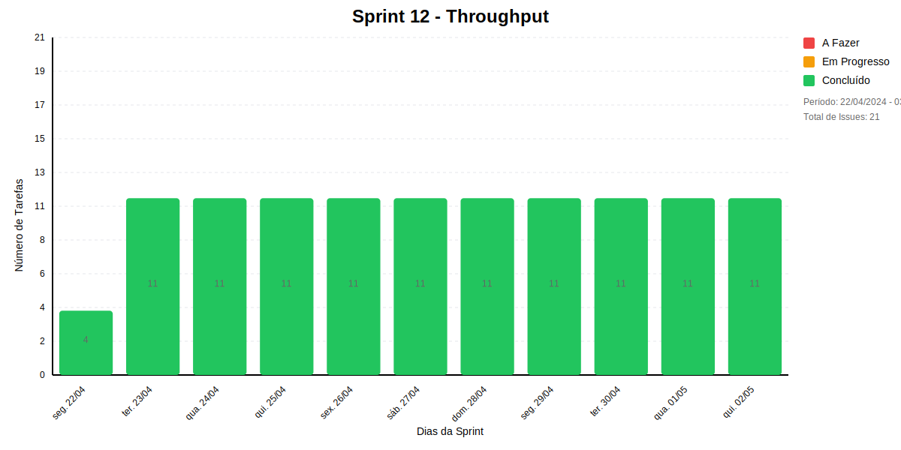
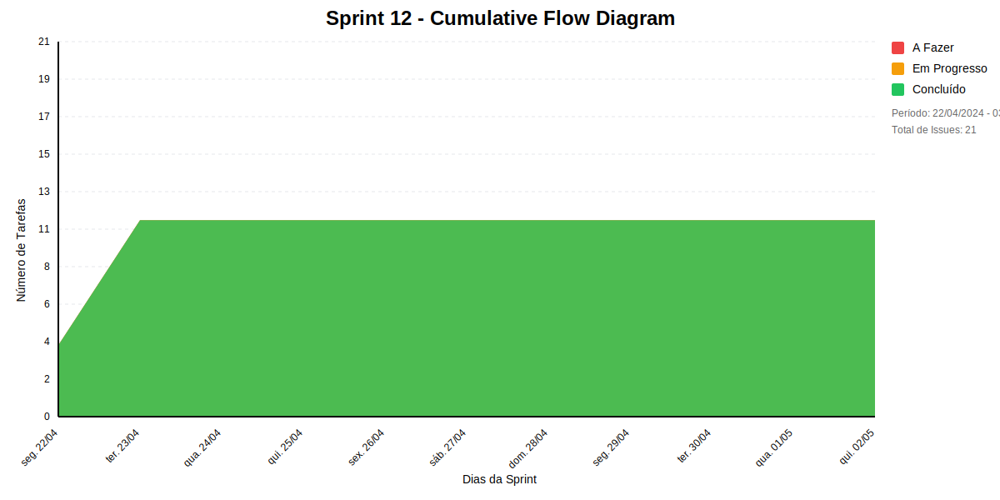

## Dados do Sprint
* **Goal**: -
* **Data Início**: 22/04/2024
* **Data Fim**: 03/05/2024
* **Status**: ACTIVE

## Sprint Backlog

|ID |Nome |Resposável |Data de Inicío | Data Planejada | Status|
|:----    |:----|:--------  |:-------:       | :----------:  | :---: |
|SLAVE-531|EU, COMO DESENVOLVEDOR, QUERO IMPLEMENTAR FUNCIONALIDADE DE REFRESH|MARCELA STARLING FERREIRA LAGE|23/04/2024|25/04/2024|CONCLUÍDO|
|SLAVE-532|EU, COMO DESENVOLVEDOR, QUERO IMPLEMENTAR TELA DE DETALHES DO PROJETO|MARCELA STARLING FERREIRA LAGE|23/04/2024|25/04/2024|CONCLUÍDO|
|SLAVE-435|EU, COMO SCRUM MASTER, QUERO CONDUZIR A REUNIÃO DE PLANEJAMENTO DA SPRINT|SOFIA DE ALCANTARA|19/03/2024|21/04/2024|CONCLUÍDO|
|SLAVE-437|EU, COMO SCRUM MASTER, QUERO CONDUZIR A REUNIÃO DE RETROSPECTIVA DA SPRINT|SOFIA DE ALCANTARA|19/03/2024|21/04/2024|EM ANDAMENTO|
|SLAVE-434|EU, COMO SCRUM MASTER, QUERO CONDUZIR A REUNIÃO DE REVISÃO DA SPRINT|SOFIA DE ALCANTARA|19/03/2024|28/04/2024|EM ANDAMENTO|
|SLAVE-466|EU, COMO DESENVOLVEDOR, QUERO REALIZAR A REFATORAÇÃO DO CÓDIGO FRONTEND DESENVOLVIDO ATÉ O MOMENTO|MARCELA STARLING FERREIRA LAGE|26/03/2024|25/04/2024|CONCLUÍDO|
|SLAVE-468|EU, COMO DESENVOLVEDOR, QUERO PROSSEGUIR OS ESTUDOS SOBRE MÉTRICAS ÁGEIS|SOFIA DE ALCANTARA|26/03/2024|-|REABERTO|
|SLAVE-475|EU, COMO DESENVOLVEDOR, QUERO GERENCIAR OS MERGE REQUEST AO LONGO DA SEMANA|VINÍCIUS ESTEVAM|26/03/2024|25/04/2024|EM ANDAMENTO|
|SLAVE-430|EU, COMO DESENVOLVEDOR, QUERO OBTER CONHECIMENTO SOBRE ODATA, VUE, OAUTH2 E MÉTRICAS ÁGEIS|SOFIA DE ALCANTARA|19/03/2024|25/04/2024|EM ANDAMENTO|
|SLAVE-429|EU, COMO SCRUM MASTER, QUERO GERENCIAR A SPRINT|SOFIA DE ALCANTARA|19/03/2024|28/04/2024|EM ANDAMENTO|
|SLAVE-464|EU, COMO DESENVOLVEDOR, QUERO REFATORAR O CÓDIGO DESENVOLVIDO ATÉ O MOMENTO|SOFIA DE ALCANTARA|26/03/2024|-|EM ANDAMENTO|
|SLAVE-391|EU, COMO DESENVOLVEDOR, QUERO FAZER A GESTÃO DE CONHECIMENTO DO MEU APRENDIZADO EM OAUTH2|VINÍCIUS ESTEVAM|19/03/2024|25/04/2024|CONCLUÍDO|
|SLAVE-269|EU, COMO DESENVOLVEDOR, QUERO FAZER A GESTÃO DE CONHECIMENTO DO MEU APRENDIZAGEM EM AWS|BRUNO CAXIAS|11/03/2024|25/04/2024|CONCLUÍDO|
|SLAVE-514|EU, COMO DESENVOLVEDOR, QUERO REALIZAR AS TAREFAS DE BACKEND PENDENTES|AUTOMATION FOR JIRA|17/04/2024|24/04/2024|EM ANDAMENTO|
|SLAVE-526|EU, COMO DESENVOLVEDOR, QUERO ASSOCIAR USUÁRIO AO SEUS RESPECTIVOS PAPÉIS|VINÍCIUS ESTEVAM|23/04/2024|25/04/2024|CONCLUÍDO|
|SLAVE-527|EU, COMO DESENVOLVEDOR, QUERO IMPLEMENTAR FUNCIONALIDADE TROCAR SENHA|VINÍCIUS ESTEVAM|23/04/2024|25/04/2024|CONCLUÍDO|
|SLAVE-528|EU, COMO DESENVOLVEDOR, QUERO INTEGRAR BACK E FRONT NA AWS|BRUNO CAXIAS|23/04/2024|25/04/2024|CONCLUÍDO|
|SLAVE-529|EU, COMO DESENVOLVEDOR, QUERO IMPLEMENTAR REGRAS NO CD|VINÍCIUS ESTEVAM|23/04/2024|25/04/2024|CONCLUÍDO|
|SLAVE-533|EU, COMO DESENVOLVEDOR, QUERO IMPLEMENTAR TELA TROCA DE SENHA|MARCELA STARLING FERREIRA LAGE|23/04/2024|25/04/2024|CONCLUÍDO|
|SLAVE-530|EU, COMO DESENVOLVEDOR, QUERO DEFINIR REDE PRIVADA AWS|BRUNO CAXIAS|23/04/2024|25/04/2024|REABERTO|
|SLAVE-537|TESTES - FRONTEND|MARCELA STARLING FERREIRA LAGE|16/05/2024|-|EM ANÁLISE|

# Relatório de Previsão da Sprint baseado no Método de Monte Carlo

## 🎯 Conclusão Principal

### ❌ ALTO RISCO DE ATRASO NA SPRINT

- **Probabilidade de conclusão no prazo**: 3.0%
- **Data mais provável de conclusão**: sex., 22/11/2024
- **Dias em relação ao planejado**: 204 dias
- **Status**: ❌ Atraso Crítico

### 📊 Métricas Críticas

| Métrica | Valor | Status |
|---------|--------|--------|
| Velocidade Atual | 1.8 tarefas/dia | ❌ |
| Velocidade Necessária | Infinity tarefas/dia | - |
| Dias Restantes | 0 dias | - |
| Tarefas Restantes | 10 tarefas | - |

### 📅 Previsões de Data de Conclusão

| Data | Probabilidade | Status | Observação |
|------|---------------|---------|------------|
| ter., 19/11/2024 | 3.0% | ❌ Atraso Crítico |  |
| qua., 20/11/2024 | 4.7% | ❌ Atraso Crítico |  |
| qui., 21/11/2024 | 5.8% | ❌ Atraso Crítico |  |
| sex., 22/11/2024 | 46.2% | ❌ Atraso Crítico | 📍 Data mais provável |
| seg., 25/11/2024 | 6.5% | ❌ Atraso Crítico |  |
| ter., 26/11/2024 | 5.7% | ❌ Atraso Crítico |  |
| qua., 27/11/2024 | 4.7% | ❌ Atraso Crítico |  |
| qui., 28/11/2024 | 3.8% | ❌ Atraso Crítico |  |
| sex., 29/11/2024 | 19.5% | ❌ Atraso Crítico |  |

### 📋 Status das Tarefas

| Status | Quantidade | Porcentagem |
|--------|------------|-------------|
| Concluído | 11 | 52.4% |
| Em Andamento | 0 | 0.0% |
| A Fazer | 0 | 0.0% |

## 💡 Recomendações

1. ❌ Realize reunião emergencial
2. ❌ Reavalie o escopo da sprint
3. ❌ Considere remover tarefas

## ℹ️ Informações da Sprint

- **Sprint**: Sprint 12
- **Início**: seg., 22/04/2024
- **Término Planejado**: sex., 03/05/2024
- **Total de Tarefas**: 21
- **Simulações Realizadas**: 10,000

---
*Relatório gerado em 18/11/2024, 11:13:16*

# Gráficos
## Throughput

## Cumulative Flow

