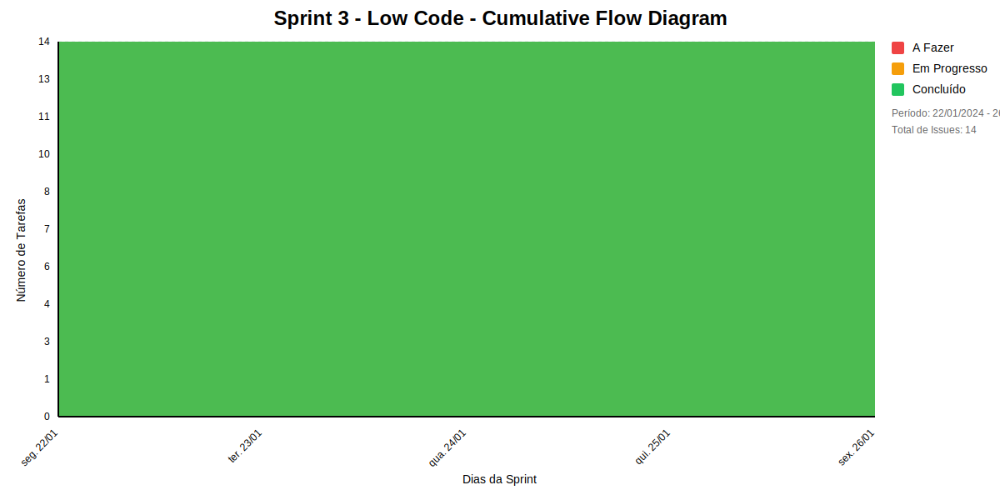

## Dados do Sprint
* **Goal**: -
* **Data Início**: 22/01/2024
* **Data Fim**: 26/01/2024
* **Status**: CLOSED

## Sprint Backlog

|ID |Nome |Resposável |Data de Inicío | Data Planejada | Status|
|:----    |:----|:--------  |:-------:       | :----------:  | :---: |
|SLAVE-44|CRIAÇÃO DE UM PROTÓTIPO DE ALTA FIDELIDADE|undefined|05/01/2024|-|CONCLUÍDO|
|SLAVE-45|TEMPO ASSÍNCRONO PARA VALIDAÇÃO DO PROTÓTIPO PELO DONO DO PROTÓTIPO|undefined|05/01/2024|-|CONCLUÍDO|
|SLAVE-46|VALIDAÇÃO DO PROTÓTIPO JUNTO AO PÚBLICO ALVO(MARCAR REUNIÃO)|undefined|05/01/2024|-|CONCLUÍDO|
|SLAVE-47|REVISÃO, ANÁLISE DOS FEEDBACK E AJUSTE DO PROTÓTIPO|undefined|05/01/2024|-|CONCLUÍDO|
|SLAVE-48|VALIDAÇÃO DO PROTÓTIPO JUNTO AO PUBLICO ALVO (MARCAR REUNIÃO)|undefined|05/01/2024|-|CONCLUÍDO|
|SLAVE-50|USAR O PLANNING POKER PARA MENSURAR OS STORY POINTS|undefined|05/01/2024|-|CONCLUÍDO|
|SLAVE-60|CRIAR UM VÍDEO DE APRESENTAÇÃO DA FERRAMENTA IMPLEMENTADA |undefined|12/01/2024|-|CONCLUÍDO|
|SLAVE-42|EU, COMO DESENVOLVEDOR, QUE ELABORAR STORYBOARDS ACERCA DO USO DO SISTEMA|undefined|05/01/2024|-|CONCLUÍDO|
|SLAVE-43|REUNIÃO PARA APRESENTAÇÃO E VALIDAÇÃO DO STORYBOARD COM DONO DO PROTÓTIPO|undefined|05/01/2024|-|CONCLUÍDO|
|SLAVE-59|INTREGRAR AS TELAS DO APPSMITH COM O STRAPI |undefined|12/01/2024|-|CONCLUÍDO|
|SLAVE-64|DESENVOLVER API COM A INFRAESTRUTURA DO PROJETO BAC|undefined|19/01/2024|-|CONCLUÍDO|
|SLAVE-56|IMPLEMENTAÇÃO DAS TELAS DO PROTÓTIPO NA FERRAMENTA APPSMITH|undefined|12/01/2024|-|CONCLUÍDO|
|SLAVE-58|CRIAR OS PAPEIS NO STRAPI |undefined|12/01/2024|-|CONCLUÍDO|
|SLAVE-49|USAR O DIÁRIO DE BORDO ÚNICO PARA O PROJETO|undefined|05/01/2024|-|CONCLUÍDO|

# Relatório de Previsão da Sprint baseado no Método de Monte Carlo

## 🎯 Conclusão Principal

### ✅ SPRINT PROVAVELMENTE SERÁ CONCLUÍDA NO PRAZO

- **Probabilidade de conclusão no prazo**: 100.0%
- **Data mais provável de conclusão**: dom., 17/11/2024
- **Dias em relação ao planejado**: 296 dias
- **Status**: ❌ Atraso Crítico

### 📊 Métricas Críticas

| Métrica | Valor | Status |
|---------|--------|--------|
| Velocidade Atual | 1.8 tarefas/dia | ❌ |
| Velocidade Necessária | NaN tarefas/dia | - |
| Dias Restantes | 0 dias | - |
| Tarefas Restantes | 0 tarefas | - |

### 📅 Previsões de Data de Conclusão

| Data | Probabilidade | Status | Observação |
|------|---------------|---------|------------|
| dom., 17/11/2024 | 100.0% | ❌ Atraso Crítico | 📍 Data mais provável |

### 📋 Status das Tarefas

| Status | Quantidade | Porcentagem |
|--------|------------|-------------|
| Concluído | 14 | 100.0% |
| Em Andamento | 0 | 0.0% |
| A Fazer | 0 | 0.0% |

## 💡 Recomendações

1. ✅ Mantenha o ritmo atual de 1.8 tarefas/dia
2. ✅ Continue monitorando impedimentos
3. ✅ Prepare-se para a próxima sprint

## ℹ️ Informações da Sprint

- **Sprint**: Sprint 3 - Low Code
- **Início**: seg., 22/01/2024
- **Término Planejado**: sex., 26/01/2024
- **Total de Tarefas**: 14
- **Simulações Realizadas**: 10,000

---
*Relatório gerado em 18/11/2024, 11:13:16*

# Gráficos
## Throughput

## Cumulative Flow

