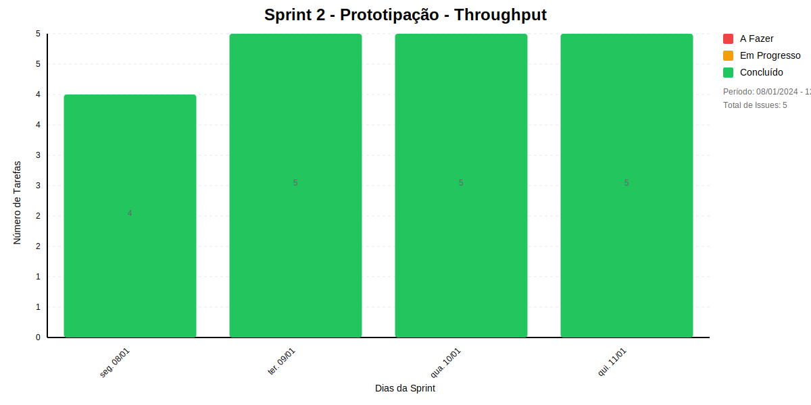
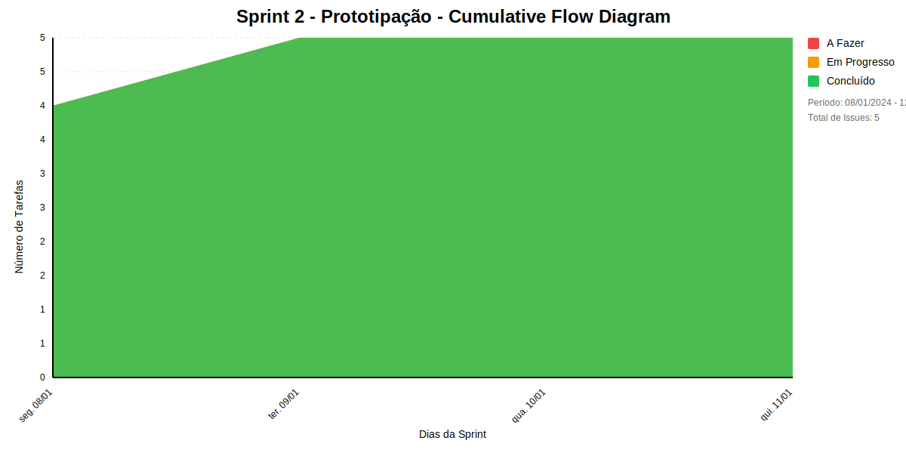

## Dados do Sprint
* **Goal**: -
* **Data Início**: 08/01/2024
* **Data Fim**: 12/01/2024
* **Status**: CLOSED

## Sprint Backlog

|ID |Nome |Resposável |Data de Inicío | Data Planejada | Status|
|:----    |:----|:--------  |:-------:       | :----------:  | :---: |
|SLAVE-30|EU, COMO DESENVOLVEDOR, QUERO IMPLEMENTAR UM STORYBOARD COM O FLUXO DE CADASTRO DE PROJETOS E MEMBROS PARA VALIDAR ENTENDER O USO DO SISTEMA PELO USUÁRIO|undefined|05/01/2024|-|CONCLUÍDO|
|SLAVE-32|EU, COMO DESENVOLVEDOR, QUERO IMPLEMENTAR O PROTOTIPO DE  ALTA FIDELIDADE E FUNCIONAL PARA APRESENTAR AO MEU USUÁRIO FINAL, VALIDAR E COLETAR FEEBACKS SOBRE O PROTÓTIPO|undefined|05/01/2024|-|CONCLUÍDO|
|SLAVE-34|EU, COMO DESENVOLVEDOR, QUERO IMPLEMENTAR O PMC PARA ORGANIZAR MELHOR O PLANO DO PROJETO|undefined|05/01/2024|-|CONCLUÍDO|
|SLAVE-35|EU, COMO SCRUM MASTER, QUERO GERENCIAR O SPRINT|SOFIA DE ALCANTARA|05/01/2024|-|CONCLUÍDO|
|SLAVE-53|EU, COMO DESENVOLVEDOR, QUERO REALIZAR O DEPLOY DA API DE TESTE|VINÍCIUS ESTEVAM|09/01/2024|-|CONCLUÍDO|

# Relatório de Previsão da Sprint baseado no Método de Monte Carlo

## 🎯 Conclusão Principal

### ⚠️ RISCO MODERADO DE ATRASO NA SPRINT

- **Probabilidade de conclusão no prazo**: 74.9%
- **Data mais provável de conclusão**: qua., 20/11/2024
- **Dias em relação ao planejado**: 299 dias
- **Status**: ❌ Atraso Crítico

### 📊 Métricas Críticas

| Métrica | Valor | Status |
|---------|--------|--------|
| Velocidade Atual | 1.5 tarefas/dia | ❌ |
| Velocidade Necessária | Infinity tarefas/dia | - |
| Dias Restantes | 0 dias | - |
| Tarefas Restantes | 3 tarefas | - |

### 📅 Previsões de Data de Conclusão

| Data | Probabilidade | Status | Observação |
|------|---------------|---------|------------|
| qua., 20/11/2024 | 74.9% | ❌ Atraso Crítico | 📍 Data mais provável |
| qui., 21/11/2024 | 25.1% | ❌ Atraso Crítico |  |

### 📋 Status das Tarefas

| Status | Quantidade | Porcentagem |
|--------|------------|-------------|
| Concluído | 3 | 50.0% |
| Em Andamento | 1 | 16.7% |
| A Fazer | 2 | 33.3% |

## 💡 Recomendações

1. ⚠️ Aumente a velocidade para Infinity tarefas/dia
2. ⚠️ Priorize as tarefas críticas
3. ⚠️ Remova impedimentos imediatamente

## ℹ️ Informações da Sprint

- **Sprint**: Sprint 3 - Low Code
- **Início**: seg., 22/01/2024
- **Término Planejado**: sex., 26/01/2024
- **Total de Tarefas**: 6
- **Simulações Realizadas**: 10,000

---
*Relatório gerado em 16/11/2024, 22:45:22*

# Metricas
## Throughput

##  Cumulate Flow

