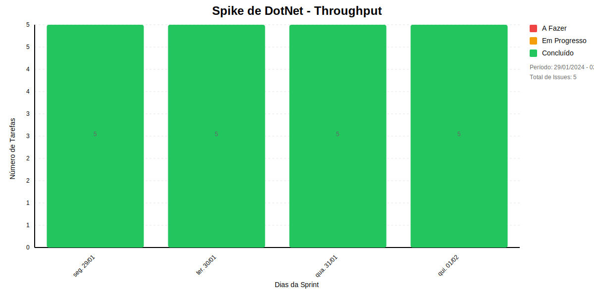
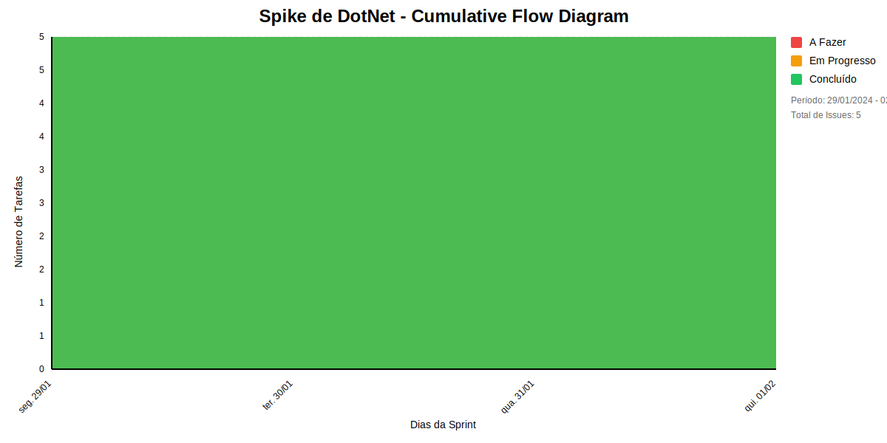

## Dados do Sprint
* **Goal**: -
* **Data Início**: 29/01/2024
* **Data Fim**: 02/02/2024
* **Status**: CLOSED

## Sprint Backlog

|ID |Nome |Resposável |Data de Inicío | Data Planejada | Status|
|:----    |:----|:--------  |:-------:       | :----------:  | :---: |
|SLAVE-67|ESTUDAR BLAZOR|MARCELA STARLING FERREIRA LAGE|26/01/2024|-|CONCLUÍDO|
|SLAVE-66|ESTUDAR ORIENTAÇAO OBJETO E FUNDAMENTO DE C#|MARCELA STARLING FERREIRA LAGE|26/01/2024|-|CONCLUÍDO|
|SLAVE-76|EU, COMO DESENVOLVEDOR, QUERO FAZER A GESTÃO DE CONHECIMENTO DO MEU APRENDIZAGEM EM DOCKER|VINÍCIUS ESTEVAM|26/01/2024|-|CONCLUÍDO|
|SLAVE-75|EU, COMO DESENVOLVEDOR, QUERO FAZER A GESTÃO DE CONHECIMENTO DO MEU APRENDIZAGEM EM TRABALHAR COM FERRAMENTAS DE LOW CODE EM EQUIPE DISTRIBUIDA|SOFIA DE ALCANTARA|26/01/2024|-|CONCLUÍDO|
|SLAVE-73|EU, COMO DESENVOLVEDOR, QUERO FAZER A GESTÃO DE CONHECIMENTO DO MEU APRENDIZAGEM EM APPSMITH|BRUNO CAXIAS|26/01/2024|-|CONCLUÍDO|

# Relatório de Previsão da Sprint baseado no Método de Monte Carlo

## 🎯 Conclusão Principal

### ✅ SPRINT PROVAVELMENTE SERÁ CONCLUÍDA NO PRAZO

- **Probabilidade de conclusão no prazo**: 100.0%
- **Data mais provável de conclusão**: dom., 17/11/2024
- **Dias em relação ao planejado**: 290 dias
- **Status**: ❌ Atraso Crítico

### 📊 Métricas Críticas

| Métrica | Valor | Status |
|---------|--------|--------|
| Velocidade Atual | 1.3 tarefas/dia | ❌ |
| Velocidade Necessária | NaN tarefas/dia | - |
| Dias Restantes | 0 dias | - |
| Tarefas Restantes | 0 tarefas | - |

### 📅 Previsões de Data de Conclusão

| Data | Probabilidade | Status | Observação |
|------|---------------|---------|------------|
| dom., 17/11/2024 | 100.0% | ❌ Atraso Crítico | 📍 Data mais provável |

### 📋 Status das Tarefas

| Status | Quantidade | Porcentagem |
|--------|------------|-------------|
| Concluído | 5 | 100.0% |
| Em Andamento | 0 | 0.0% |
| A Fazer | 0 | 0.0% |

## 💡 Recomendações

1. ✅ Mantenha o ritmo atual de 1.3 tarefas/dia
2. ✅ Continue monitorando impedimentos
3. ✅ Prepare-se para a próxima sprint

## ℹ️ Informações da Sprint

- **Sprint**: Spike de DotNet
- **Início**: seg., 29/01/2024
- **Término Planejado**: sex., 02/02/2024
- **Total de Tarefas**: 5
- **Simulações Realizadas**: 10,000

---
*Relatório gerado em 18/11/2024, 11:13:16*

# Gráficos
## Throughput

## Cumulative Flow

