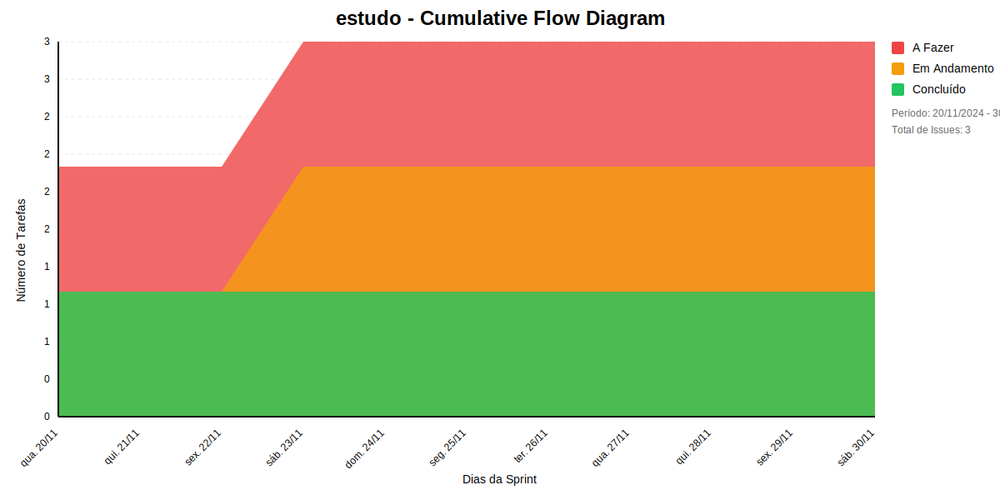

## Dados do Sprint
* **Goal**:  estudoooo
* **Data Início**: 20/11/2024
* **Data Fim**: 30/11/2024

## Sprint Backlog

|ID |Nome |Resposável |Data de Inicío | Data Planejada | Status|
|:----    |:----|:--------  |:-------:       | :----------:  | :---: |
|AUTENTICACAO|CRIAR MÓDULO DE AUTORIZAÇÃO|RAFAEL EMERICK|20/11/2024|30/11/2024|TODO|
|ESTUDO|ESTUDAR A ARQUITETURA DE AUTORIZAÇÃO PROPOSTA PELO NIS|RAFAEL EMERICK|23/11/2024|30/11/2024|DOING|
|ESTUDO|ESTUDAR A ARQUITETURA DE AUTORIZAÇÃO PROPOSTA PELO NIS|RAFAEL EMERICK|20/11/2024|30/11/2024|DONE|

# Gráficos
## Throughput

## Cumulative Flow

 # Relatório de Previsão da Sprint baseado no Método de Monte Carlo

 ## 🎯 Conclusão Principal

 ### ✅ SPRINT PROVAVELMENTE SERÁ CONCLUÍDA NO PRAZO

 - **Probabilidade de conclusão no prazo**: 100.0%
 - **Data mais provável de conclusão**: sex., 22/11/2024
 - **Dias em relação ao planejado**: -7 dias
 - **Status**: ✅ Antes do Prazo

 ### 📊 Métricas Críticas

 | Métrica | Valor | Status |
 |---------|--------|--------|
 | Velocidade Atual | 1.0 tarefas/dia | ✅ |
 | Velocidade Necessária | 0.2 tarefas/dia | - |
 | Dias Restantes | 9 dias | - |
 | Tarefas Restantes | 2 tarefas | - |

 ### 📅 Previsões de Data de Conclusão

 | Data | Probabilidade | Status | Observação |
 |------|---------------|---------|------------|
 | sex., 22/11/2024 | 100.0% | ✅ Antes do Prazo | 📍 Data mais provável |

 ### 📋 Status das Tarefas

 | Status | Quantidade | Porcentagem |
 |--------|------------|-------------|
 | Concluído | 1 | 33.3% |
 | Em Andamento | 1 | 33.3% |
 | A Fazer | 1 | 33.3% |

 ## 💡 Recomendações

 1. ✅ Mantenha o ritmo atual de 1.0 tarefas/dia
 2. ✅ Continue monitorando impedimentos
 3. ✅ Prepare-se para a próxima sprint

 ## ℹ️ Informações da Sprint

 - **Sprint**: estudo
 - **Início**: qua., 20/11/2024
 - **Término Planejado**: sáb., 30/11/2024
 - **Total de Tarefas**: 3
 - **Simulações Realizadas**: 10,000

 ---
 *Relatório gerado em 21/11/2024, 20:50:15*
