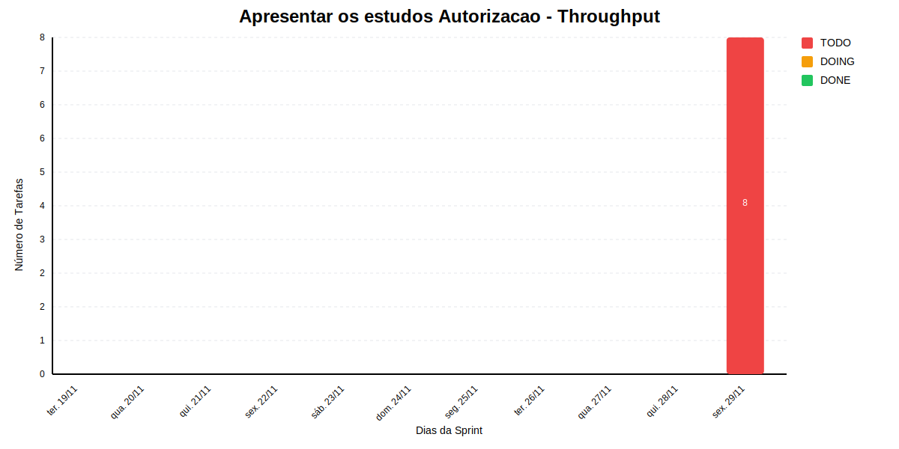

# APRESENTAR OS ESTUDOS AUTORIZACAO

Apresentar estudos sobre OPA e openFGA

## Dados do Sprint
* **Goal**:  Apresentar estudos sobre OPA e openFGA
* **Data Início**: 2024-11-20
* **Data Fim**: 2024-11-30
* **Status**: PLANNED
## Sprint Backlog

|Nome |Descrição|Resposável |Data de Inicio Planejada| Data de Entrega Planejada| Data de Inicío | Data Entrega | Status|
|:----|:---------|:-------- |:----------------------:| :-----------------------:| :------------: |:------------:|:-----:|
|Levantar principais serviços AWS||PauloYo||||2024-11-30|TODO|
|Comparar custos AWS||Jonathancastrosilva||||2024-11-30|TODO|
|Mapear recursos do Azure||Jonathancastrosilva||||2024-11-30|TODO|
|Criar apresentação sobre Azure||PauloYo||||2024-11-30|TODO|
|Escolher ferramenta de CI/CD||Jonathancastrosilva||||2024-11-30|TODO|
|Configurar pipeline de exemplo||PauloYo||||2024-11-30|TODO|
|Selecionar ferramenta de monitoramento||PauloYo||||2024-11-30|TODO|
|Criar dashboard de monitoramento||Jonathancastrosilva||||2024-11-30|TODO|
     
## Gantt 

```mermaid
gantt
    dateFormat YYYY-MM-DD
    axisFormat %d/%m


    section Sprint - Apresentar os estudos Autorizacao
```

# Análise de Dependências do Sprint

Análise gerada em: 01/07/2025, 22:51:43

## 🔍 Grafo de Dependências

```mermaid
graph BT
    classDef sprint fill:#a8e6cf,stroke:#333,stroke-width:2px;
    classDef done fill:#98fb98,stroke:#333,stroke-width:2px;
    classDef external fill:#ffd3b6,stroke:#333,stroke-width:1px;
    spike3.cloudcomputing.aws.levantarservicos["🔍 spike3.cloudcomputing.aws.levantarservicos<br>📊 Status: EXTERNAL<br>⚠️ Dependência Externa"]:::external
    spike3.cloudcomputing.azure.mapearrecursos["🔍 spike3.cloudcomputing.azure.mapearrecursos<br>📊 Status: EXTERNAL<br>⚠️ Dependência Externa"]:::external
    spike3.devops.pipelines.escolherferramenta["🔍 spike3.devops.pipelines.escolherferramenta<br>📊 Status: EXTERNAL<br>⚠️ Dependência Externa"]:::external
    spike3.devops.monitoramento.selecionarferramenta["🔍 spike3.devops.monitoramento.selecionarferramenta<br>📊 Status: EXTERNAL<br>⚠️ Dependência Externa"]:::external
    aws.levantarservicos["📝 Tarefa: Levantar principais serviços AWS<br>📊 Estado: TODO<br>👤 Responsável: PauloYo"]:::sprint
    aws.compararcustos["📝 Tarefa: Comparar custos AWS<br>📊 Estado: TODO<br>👤 Responsável: Jonathancastrosilva"]:::sprint
    azure.mapearrecursos["📝 Tarefa: Mapear recursos do Azure<br>📊 Estado: TODO<br>👤 Responsável: Jonathancastrosilva"]:::sprint
    azure.criarapresentacao["📝 Tarefa: Criar apresentação sobre Azure<br>📊 Estado: TODO<br>👤 Responsável: PauloYo"]:::sprint
    pipelines.escolherferramenta["📝 Tarefa: Escolher ferramenta de CI/CD<br>📊 Estado: TODO<br>👤 Responsável: Jonathancastrosilva"]:::sprint
    pipelines.configurarpipeline["📝 Tarefa: Configurar pipeline de exemplo<br>📊 Estado: TODO<br>👤 Responsável: PauloYo"]:::sprint
    monitoramento.selecionarferramenta["📝 Tarefa: Selecionar ferramenta de monitoramento<br>📊 Estado: TODO<br>👤 Responsável: PauloYo"]:::sprint
    monitoramento.criardashboard["📝 Tarefa: Criar dashboard de monitoramento<br>📊 Estado: TODO<br>👤 Responsável: Jonathancastrosilva"]:::sprint
    aws.compararcustos -.-> spike3.cloudcomputing.aws.levantarservicos
    azure.criarapresentacao -.-> spike3.cloudcomputing.azure.mapearrecursos
    pipelines.configurarpipeline -.-> spike3.devops.pipelines.escolherferramenta
    monitoramento.criardashboard -.-> spike3.devops.monitoramento.selecionarferramenta
```



**Legenda:**
- 🟢 Verde Claro: Issues no sprint
- 🟢 Verde Escuro: Issues concluídas
- 🟡 Laranja: Dependências externas ao sprint
- ➡️ Linha sólida: Dependência no sprint
- ➡️ Linha pontilhada: Dependência externa

## 📋 Sugestão de Execução das Issues

| # | Título | Status | Responsável | Dependências |
|---|--------|--------|-------------|---------------|
| 1 | Levantar principais serviços AWS | TODO | PauloYo | 🆓 |
| 2 | Comparar custos AWS | TODO | Jonathancastrosilva | spike3.cloudcomputing.aws.levantarservicos⚠️ |
| 3 | Mapear recursos do Azure | TODO | Jonathancastrosilva | 🆓 |
| 4 | Criar apresentação sobre Azure | TODO | PauloYo | spike3.cloudcomputing.azure.mapearrecursos⚠️ |
| 5 | Escolher ferramenta de CI/CD | TODO | Jonathancastrosilva | 🆓 |
| 6 | Configurar pipeline de exemplo | TODO | PauloYo | spike3.devops.pipelines.escolherferramenta⚠️ |
| 7 | Selecionar ferramenta de monitoramento | TODO | PauloYo | 🆓 |
| 8 | Criar dashboard de monitoramento | TODO | Jonathancastrosilva | spike3.devops.monitoramento.selecionarferramenta⚠️ |

**Legenda das Dependências:**
- 🆓 Sem dependências
- ✅ Issue concluída
- ⚠️ Dependência externa ao sprint

            
## Cumulative Flow


## Throughput

        

        