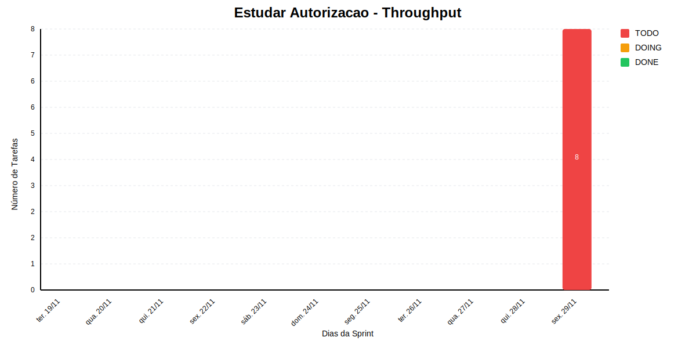

# ESTUDAR AUTORIZACAO

Realizar estudos sobre autorizacao

## Dados do Sprint
* **Goal**:  Realizar estudos sobre autorizacao
* **Data Início**: 2024-11-20
* **Data Fim**: 2024-11-30
* **Status**: IN_PROGRESS
## Sprint Backlog

|Nome |Descrição|Resposável |Data de Inicio Planejada| Data de Entrega Planejada| Data de Inicío | Data Entrega | Status|
|:----|:---------|:-------- |:----------------------:| :-----------------------:| :------------: |:------------:|:-----:|
|Pesquisar tecnologias de firewall||PauloYo||||2024-11-30|TODO|
|Estudar funcionamento de IDS||Jonathancastrosilva||||2024-11-30|TODO|
|Revisar literatura sobre algoritmos simétricos||Jonathancastrosilva||||2024-11-30|TODO|
|Criar resumo comparativo||PauloYo||||2024-11-30|TODO|
|Elaborar relatório sobre firewalls||Jonathancastrosilva||||2024-11-30|TODO|
|Apresentar resultados do estudo de IDS||PauloYo||||2024-11-30|TODO|
|Documentar código da demo||Jonathancastrosilva||||2024-11-30|TODO|
|Implementar demo de criptografia assimétrica||PauloYo||||2024-11-30|TODO|
     
## Gantt 

```mermaid
gantt
    dateFormat YYYY-MM-DD
    axisFormat %d/%m


    section Sprint - Estudar Autorizacao
```

# Análise de Dependências do Sprint

Análise gerada em: 01/07/2025, 00:10:27

## 🔍 Grafo de Dependências

```mermaid
graph BT
    classDef sprint fill:#a8e6cf,stroke:#333,stroke-width:2px;
    classDef done fill:#98fb98,stroke:#333,stroke-width:2px;
    classDef external fill:#ffd3b6,stroke:#333,stroke-width:1px;
    spike.criptografia.algoritmossimetricos.revisarliteratura["🔍 spike.criptografia.algoritmossimetricos.revisarliteratura<br>📊 Status: EXTERNAL<br>⚠️ Dependência Externa"]:::external
    spike.segurancaredes.firewall.pesquisartecnologias["🔍 spike.segurancaredes.firewall.pesquisartecnologias<br>📊 Status: EXTERNAL<br>⚠️ Dependência Externa"]:::external
    spike.segurancaredes.ids.estudarids["🔍 spike.segurancaredes.ids.estudarids<br>📊 Status: EXTERNAL<br>⚠️ Dependência Externa"]:::external
    spike.criptografia.algoritmosassimetricos.implementardemo["🔍 spike.criptografia.algoritmosassimetricos.implementardemo<br>📊 Status: EXTERNAL<br>⚠️ Dependência Externa"]:::external
    firewall.pesquisartecnologias["📝 Tarefa: Pesquisar tecnologias de firewall<br>📊 Estado: TODO<br>👤 Responsável: PauloYo"]:::sprint
    ids.estudarids["📝 Tarefa: Estudar funcionamento de IDS<br>📊 Estado: TODO<br>👤 Responsável: Jonathancastrosilva"]:::sprint
    algoritmossimetricos.revisarliteratura["📝 Tarefa: Revisar literatura sobre algoritmos simétricos<br>📊 Estado: TODO<br>👤 Responsável: Jonathancastrosilva"]:::sprint
    algoritmossimetricos.criarresumo["📝 Tarefa: Criar resumo comparativo<br>📊 Estado: TODO<br>👤 Responsável: PauloYo"]:::sprint
    firewall.elaborarrelatorio["📝 Tarefa: Elaborar relatório sobre firewalls<br>📊 Estado: TODO<br>👤 Responsável: Jonathancastrosilva"]:::sprint
    ids.apresentarresultados["📝 Tarefa: Apresentar resultados do estudo de IDS<br>📊 Estado: TODO<br>👤 Responsável: PauloYo"]:::sprint
    algoritmosassimetricos.documentarcodigo["📝 Tarefa: Documentar código da demo<br>📊 Estado: TODO<br>👤 Responsável: Jonathancastrosilva"]:::sprint
    algoritmosassimetricos.implementardemo["📝 Tarefa: Implementar demo de criptografia assimétrica<br>📊 Estado: TODO<br>👤 Responsável: PauloYo"]:::sprint
    algoritmossimetricos.criarresumo -.-> spike.criptografia.algoritmossimetricos.revisarliteratura
    firewall.elaborarrelatorio -.-> spike.segurancaredes.firewall.pesquisartecnologias
    ids.apresentarresultados -.-> spike.segurancaredes.ids.estudarids
    algoritmosassimetricos.documentarcodigo -.-> spike.criptografia.algoritmosassimetricos.implementardemo
```



**Legenda:**
- 🟢 Verde Claro: Issues no sprint
- 🟢 Verde Escuro: Issues concluídas
- 🟡 Laranja: Dependências externas ao sprint
- ➡️ Linha sólida: Dependência no sprint
- ➡️ Linha pontilhada: Dependência externa

## 📋 Sugestão de Execução das Issues

| # | Título | Status | Responsável | Dependências |
|---|--------|--------|-------------|---------------|
| 1 | Pesquisar tecnologias de firewall | TODO | PauloYo | 🆓 |
| 2 | Estudar funcionamento de IDS | TODO | Jonathancastrosilva | 🆓 |
| 3 | Revisar literatura sobre algoritmos simétricos | TODO | Jonathancastrosilva | 🆓 |
| 4 | Criar resumo comparativo | TODO | PauloYo | spike.criptografia.algoritmossimetricos.revisarliteratura⚠️ |
| 5 | Elaborar relatório sobre firewalls | TODO | Jonathancastrosilva | spike.segurancaredes.firewall.pesquisartecnologias⚠️ |
| 6 | Apresentar resultados do estudo de IDS | TODO | PauloYo | spike.segurancaredes.ids.estudarids⚠️ |
| 7 | Documentar código da demo | TODO | Jonathancastrosilva | spike.criptografia.algoritmosassimetricos.implementardemo⚠️ |
| 8 | Implementar demo de criptografia assimétrica | TODO | PauloYo | 🆓 |

**Legenda das Dependências:**
- 🆓 Sem dependências
- ✅ Issue concluída
- ⚠️ Dependência externa ao sprint

            
## Cumulative Flow


## Throughput

        
# Previsão da Sprint

## ✅ SPRINT PROVAVELMENTE SERÁ CONCLUÍDA NO PRAZO

- **Probabilidade de conclusão no prazo**: 100.0%
- **Data mais provável de conclusão**: qui., 10/07/2025
- **Dias em relação ao planejado**: 223 dias
- **Status**: ❌ Atraso Crítico

### 📊 Métricas Críticas

| Métrica | Valor | Status |
|---------|--------|--------|
| Velocidade Atual | 1.0 tarefas/dia | ❌ |
| Velocidade Necessária | 8.0 tarefas/dia | - |
| Dias Restantes | 1 dias | - |
| Tarefas Restantes | 8 tarefas | - |

### 📅 Previsões de Data de Conclusão

| Data | Probabilidade | Status | Observação |
|------|---------------|---------|------------|
| qui., 10/07/2025 | 100.0% | ❌ Atraso Crítico | 📍 Data mais provável |

### 📋 Status das Tarefas

| Status | Quantidade | Porcentagem |
|--------|------------|-------------|
| Concluído | 0 | 0.0% |
| Em Andamento | 0 | 0.0% |
| A Fazer | 8 | 100.0% |

## 💡 Recomendações

1. ✅ Mantenha o ritmo atual de 1.0 tarefas/dia
2. ✅ Continue monitorando impedimentos
3. ✅ Prepare-se para a próxima sprint

## ℹ️ Informações da Sprint

- **Sprint**: Estudar Autorizacao
- **Início**: ter., 19/11/2024
- **Término Planejado**: sex., 29/11/2024
- **Total de Tarefas**: 8
- **Simulações Realizadas**: 10,000

---
*Relatório gerado em 01/07/2025, 00:10:27*
        