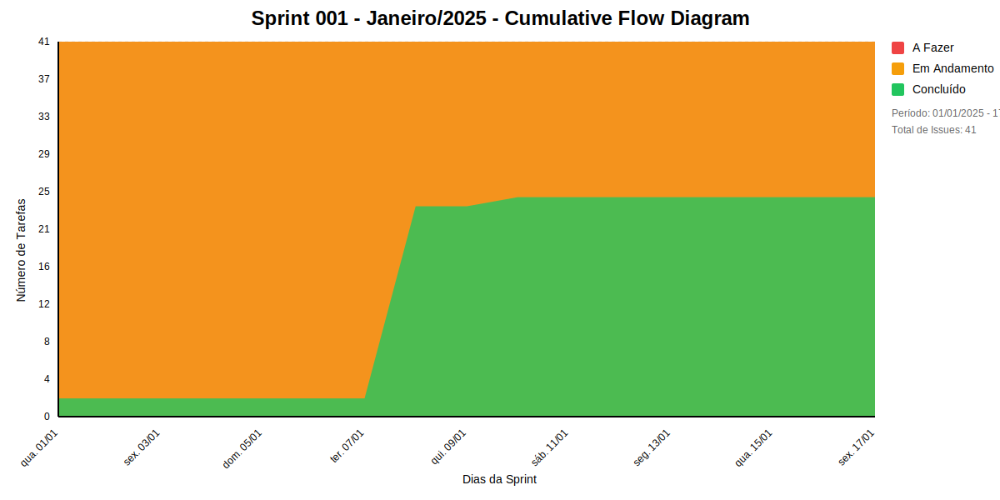

# SPRINT 001 - JANEIRO/2025

Estabelecer primeira versão de uma pipeline de QA funcional para auxilio na garantia da qualidade do software. Finalizar scripts do módulo 'Modalidades de Bolsas'. Desenvolver primeira versão do sistema de chamados, com módulo de coleta e registro de mensagens.

## Dados do Sprint
* **Goal**:  Estabelecer primeira versão de uma pipeline de QA funcional para auxilio na garantia da qualidade do software. Finalizar scripts do módulo 'Modalidades de Bolsas'. Desenvolver primeira versão do sistema de chamados, com módulo de coleta e registro de mensagens.
* **Data Início**: 2025-01-01
* **Data Fim**: 2025-01-17
* **Status**: IN_PROGRESS
## Sprint Backlog

|Nome |Resposável |Data de Inicío | Data Planejada | Status|
|:----|:--------  |:-------:       | :----------:  | :---: |
|Criar planilha de testes do módulo|Sofia de Alcantara|2024-12-04|2024-12-06|DONE|
|Organizar repositório de testes para o módulo|Sofia de Alcantara|2024-12-04|2024-12-06|DONE|
|Implementar o pipeline de testing usando Drone|Davi Nunes|2024-12-04|2025-01-31|DONE|
|Executar Teste de Funcionalidade|Leandro Carone|2024-12-04|2025-01-31|DOING|
|Executar Teste de Performance|Leandro Carone|2024-12-04|2025-01-31|DOING|
|Executar Teste de Funcionalidade|Leandro Carone|2024-12-04|2025-01-31|DOING|
|Executar Teste de Performance|Leandro Carone|2024-12-04|2025-01-31|DOING|
|Executar Teste de Funcionalidade|Leandro Carone|2024-12-04|2025-01-31|DOING|
|Executar Teste de Performance|Leandro Carone|2024-12-04|2025-01-31|DOING|
|Executar Teste de Funcionalidade|Leandro Carone|2024-12-04|2025-01-31|DOING|
|Executar Teste de Performance|Leandro Carone|2024-12-04|2025-01-31|DOING|
|Executar Teste de Funcionalidade|Leandro Carone|2024-12-04|2025-01-31|DOING|
|Executar Teste de Performance|Leandro Carone|2024-12-04|2025-01-31|DOING|
|Executar Teste de Funcionalidade|Leandro Carone|2024-12-04|2025-01-31|DOING|
|Executar Teste de Performance|Leandro Carone|2024-12-04|2025-01-31|DOING|
|Executar Teste de Funcionalidade|Leandro Carone|2024-12-04|2025-01-31|DOING|
|Executar Teste de Performance|Leandro Carone|2024-12-04|2025-01-31|DOING|
|Criar documentação|Leandro Carone|2024-12-04|2025-01-31|DONE|
|Executar Teste de Funcionalidade|Leandro Carone|2024-12-04|2025-01-31|DOING|
|Executar Teste de Performance|Leandro Carone|2024-12-04|2025-01-31|DOING|
|Executar Teste de Funcionalidade|Leandro Carone|2024-12-04|2025-01-31|DOING|
|Executar Teste de Performance|Leandro Carone|2024-12-04|2025-01-31|DOING|
|Executar Teste de Funcionalidade|Leandro Carone|2024-12-04|2025-01-31|DOING|
|Executar Teste de Performance|Leandro Carone|2024-12-04|2025-01-31|DOING|
|Executar Teste de Funcionalidade|Leandro Carone|2024-12-04|2025-01-31|DOING|
|Executar Teste de Performance|Leandro Carone|2024-12-04|2025-01-31|DOING|
|Executar Teste de Funcionalidade|Leandro Carone|2024-12-04|2025-01-31|DOING|
|Executar Teste de Performance|Leandro Carone|2024-12-04|2025-01-31|DOING|
|Executar Teste de Funcionalidade|Leandro Carone|2024-12-04|2025-01-31|TODO|
|Executar Teste de Performance|Leandro Carone|2024-12-04|2025-01-31|TODO|
|Executar Teste de Funcionalidade|Leandro Carone|2024-12-04|2025-01-31|TODO|
|Executar Teste de Performance|Leandro Carone|2024-12-04|2025-01-31|TODO|
|Executar Teste de Funcionalidade|Leandro Carone|2024-12-04|2025-01-31|TODO|
|Executar Teste de Performance|Leandro Carone|2024-12-04|2025-01-31|TODO|
|Executar Teste de Funcionalidade|Leandro Carone|2024-12-04|2025-01-31|TODO|
|Executar Teste de Performance|Leandro Carone|2024-12-04|2025-01-31|TODO|
|Executar Teste de Funcionalidade|Leandro Carone|2024-12-04|2025-01-31|TODO|
|Executar Teste de Performance|Leandro Carone|2024-12-04|2025-01-31|TODO|
|alinhamento de refatoração de código para inclusão do atributo data-test|Luan Otoni|2024-12-04|2025-01-31|DOING|
|implementar o script|Luan Otoni|2024-12-04|2025-01-31|DOING|
|executar a teste|Luan Otoni|2024-12-04|2025-01-31|DOING|
      
# Análise de Dependências do Sprint

Análise gerada em: 2025-01-15, 09:32:21

## 🔍 Grafo de Dependências

**Legenda:**
- 🟢 Verde Claro: Issues no sprint
- 🟢 Verde Escuro: Issues concluídas
- 🟡 Laranja: Dependências externas ao sprint
- ➡️ Linha sólida: Dependência no sprint
- ➡️ Linha pontilhada: Dependência externa

## 📋 Sugestão de Execução das Issues

| # | Título | Status | Responsável | Dependências |
|---|--------|--------|-------------|---------------|
| 1 | Criar planilha de testes do módulo | DONE | Sofia de Alcantara | 🆓 |
| 2 | Organizar repositório de testes para o módulo | DONE | Sofia de Alcantara | 🆓 |
| 3 | Implementar o pipeline de testing usando Drone | DONE | Davi Nunes | 🆓 |
| 4 | Executar Teste de Funcionalidade | DOING | Leandro Carone | 🆓 |
| 5 | Executar Teste de Performance | DOING | Leandro Carone | 🆓 |
| 6 | Executar Teste de Funcionalidade | DOING | Leandro Carone | 🆓 |
| 7 | Executar Teste de Performance | DOING | Leandro Carone | 🆓 |
| 8 | Executar Teste de Funcionalidade | DOING | Leandro Carone | 🆓 |
| 9 | Executar Teste de Performance | DOING | Leandro Carone | 🆓 |
| 10 | Executar Teste de Funcionalidade | DOING | Leandro Carone | 🆓 |
| 11 | Executar Teste de Performance | DOING | Leandro Carone | 🆓 |
| 12 | Executar Teste de Funcionalidade | DOING | Leandro Carone | 🆓 |
| 13 | Executar Teste de Performance | DOING | Leandro Carone | 🆓 |
| 14 | Executar Teste de Funcionalidade | DOING | Leandro Carone | 🆓 |
| 15 | Executar Teste de Performance | DOING | Leandro Carone | 🆓 |
| 16 | Executar Teste de Funcionalidade | DOING | Leandro Carone | 🆓 |
| 17 | Executar Teste de Performance | DOING | Leandro Carone | 🆓 |
| 18 | Criar documentação | DONE | Leandro Carone | 🆓 |
| 19 | Executar Teste de Funcionalidade | DOING | Leandro Carone | 🆓 |
| 20 | Executar Teste de Performance | DOING | Leandro Carone | 🆓 |
| 21 | Executar Teste de Funcionalidade | DOING | Leandro Carone | 🆓 |
| 22 | Executar Teste de Performance | DOING | Leandro Carone | 🆓 |
| 23 | Executar Teste de Funcionalidade | DOING | Leandro Carone | 🆓 |
| 24 | Executar Teste de Performance | DOING | Leandro Carone | 🆓 |
| 25 | Executar Teste de Funcionalidade | DOING | Leandro Carone | 🆓 |
| 26 | Executar Teste de Performance | DOING | Leandro Carone | 🆓 |
| 27 | Executar Teste de Funcionalidade | DOING | Leandro Carone | 🆓 |
| 28 | Executar Teste de Performance | DOING | Leandro Carone | 🆓 |
| 29 | Executar Teste de Funcionalidade | TODO | Leandro Carone | 🆓 |
| 30 | Executar Teste de Performance | TODO | Leandro Carone | 🆓 |
| 31 | Executar Teste de Funcionalidade | TODO | Leandro Carone | 🆓 |
| 32 | Executar Teste de Performance | TODO | Leandro Carone | 🆓 |
| 33 | Executar Teste de Funcionalidade | TODO | Leandro Carone | 🆓 |
| 34 | Executar Teste de Performance | TODO | Leandro Carone | 🆓 |
| 35 | Executar Teste de Funcionalidade | TODO | Leandro Carone | 🆓 |
| 36 | Executar Teste de Performance | TODO | Leandro Carone | 🆓 |
| 37 | Executar Teste de Funcionalidade | TODO | Leandro Carone | 🆓 |
| 38 | Executar Teste de Performance | TODO | Leandro Carone | 🆓 |
| 39 | alinhamento de refatoração de código para inclusão do atributo data-test | DOING | Luan Otoni | 🆓 |
| 40 | implementar o script | DOING | Luan Otoni | 🆓 |
| 41 | executar a teste | DOING | Luan Otoni | 🆓 |

**Legenda das Dependências:**
- 🆓 Sem dependências
- ✅ Issue concluída
- ⚠️ Dependência externa ao sprint

        
       
## Cumulative Flow

        
# Previsão da Sprint

## ✅ SPRINT PROVAVELMENTE SERÁ CONCLUÍDA NO PRAZO

- **Probabilidade de conclusão no prazo**: 100.0%
- **Data mais provável de conclusão**: ter., 2025-01-28
- **Dias em relação ao planejado**: 12 dias
- **Status**: ❌ Atraso Crítico

### 📊 Métricas Críticas

| Métrica | Valor | Status |
|---------|--------|--------|
| Velocidade Atual | 4.0 tarefas/dia | ❌ |
| Velocidade Necessária | 18.5 tarefas/dia | - |
| Dias Restantes | 2 dias | - |
| Tarefas Restantes | 37 tarefas | - |

### 📅 Previsões de Data de Conclusão

| Data | Probabilidade | Status | Observação |
|------|---------------|---------|------------|
| 2025-01-28 | 100.0% | ❌ Atraso Crítico | 📍 Data mais provável |

### 📋 Status das Tarefas

| Status | Quantidade | Porcentagem |
|--------|------------|-------------|
| Concluído | 4 | 9.8% |
| Em Andamento | 27 | 65.9% |
| A Fazer | 10 | 24.4% |

## 💡 Recomendações

1. ✅ Mantenha o ritmo atual de 4.0 tarefas/dia
2. ✅ Continue monitorando impedimentos
3. ✅ Prepare-se para a próxima sprint

## ℹ️ Informações da Sprint

- **Sprint**: Sprint 001 - Janeiro/2025
- **Data Início**: 2025-01-01
- **Data Fim**: 2025-01-17
- **Término Planejado**: 2025-01-17
- **Total de Tarefas**: 41
- **Simulações Realizadas**: 10,000

---
*Relatório gerado em 2025-01-15, 09:32:21*
        