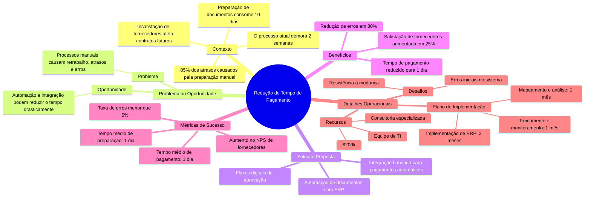

```mermaid
mindmap
  root((Redução do Tempo de Pagamento))
    Contexto
      O processo atual demora 2 semanas
      Preparação de documentos consome 10 dias
      85% dos atrasos causados pela preparação manual
      Insatisfação de fornecedores afeta contratos futuros
    Problema ou Oportunidade
      Problema
        Processos manuais causam retrabalho, atrasos e erros
      Oportunidade
        Automação e integração podem reduzir o tempo drasticamente
    Solução Proposta
      Automação de documentos com ERP
      Integração bancária para pagamentos automáticos
      Fluxos digitais de aprovação
    Benefícios
      Redução de erros em 80%
      Satisfação de fornecedores aumentada em 25%
      Tempo de pagamento reduzido para 1 dia
    Métricas de Sucesso
      Tempo médio de preparação: 1 dia
      Tempo médio de pagamento: 1 dia
      Taxa de erros menor que 5%
      Aumento no NPS de fornecedores
    Detalhes Operacionais
      Plano de Implementação
        Mapeamento e análise: 1 mês
        Implementação de ERP: 3 meses
        Treinamento e monitoramento: 1 mês
      Recursos
        $200k
        Equipe de TI
        Consultoria especializada
      Desafios
        Resistência à mudança
        Erros iniciais no sistema
```